# Urban Decay is a Verb

*v1.0.0 · a photo-essay · thirteen plates · Johannesburg, and elsewhere, 2012–2026*

_A photo-essay. Several of the pictures are an argument, this text is what I owe them._

---

The garbage trucks stopped coming, and when they came back the whistles were beautiful. The trucks had not changed, not much, and yet something about the trucks was different.

That is the first trap in the wordphrase urban decay. It pretends the thing itself has failed.

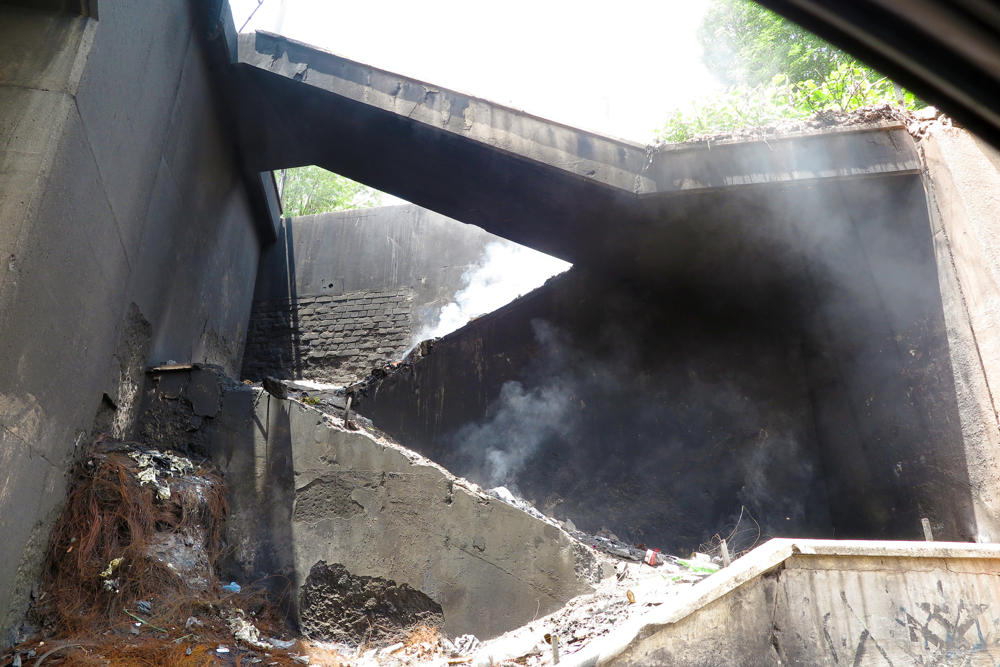

> **Plate 1 · `IMG_1278_urban_decay_is_a_verb`**
> *Urban Decay is a Verb.* Joe Slovo Drive, Johannesburg. A Sunday morning, 2023. PowerShot G1X MkII, through the vehicle window.

A pedestrian staircase smouldering by itself on a Sunday morning, shot through a car window. The window stays in the picture. We will come back to the window in a moment.

Not to the staircase burning. Cable burning under it: insulation cooked off for the copper. The smell tells you.

The photograph knows less than the body did. It gives concrete, bright noon, smoke, the stair as scarred geometry, green pushing down over the top edge, some small red thing in the dust that insists on being seen without agreeing to mean anything. It does not give the smell, nor the few hundred rand, or the hands, or why the hands needed to.

Sometimes a text has to carry what a frame cannot.

---

## Banked

A city's mass is banked relation. Grids, girders, reticulation, 4am shifts poured as concrete. Somebody surveyed that corner. Somebody costed that span. Somebody carried a theodolite up a hill in 1936, and somebody has been paying for it ever since, in instalments nobody itemises.

That is what is standing there. Not stone. Held decisions.

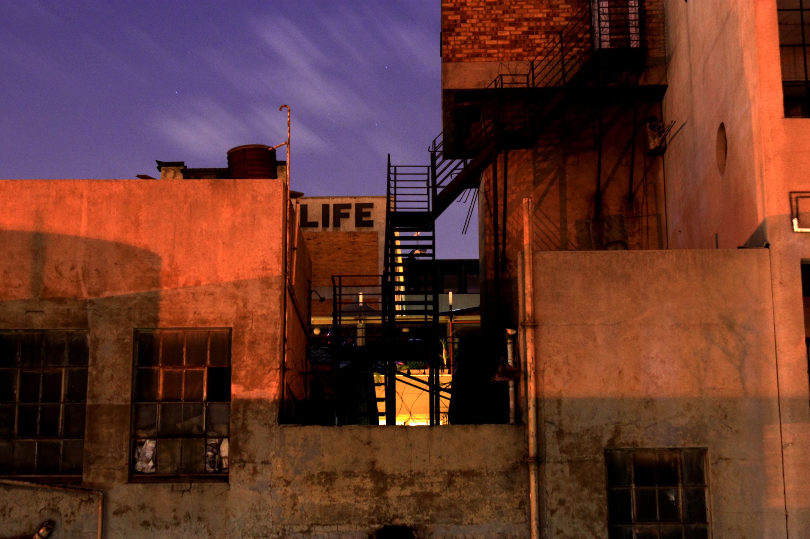

> **Plate 2 · `Life(ASClem_2015_07_29_1293)`**
> *Life.* Johannesburg, 29 July 2015, 21:33.

Decay is not mass leaving. It is the field withdrawing (capital, concern) - how much a kilogram weighs depends on where you are. The structure stands like a score nobody sings. Some of the windows still light. The lease is still on somebody's books at a number that stopped being true probably somewhere around 2009.

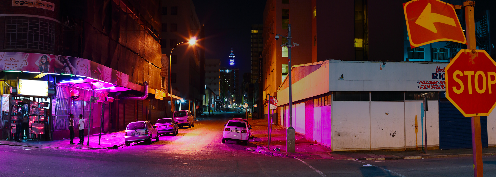

> **Plate 3 · `04_crop_colour_3200`**
> Johannesburg CBD, 19 March 2017, 02:22.

And the city is not empty, which empty pictures conveniently, or is it necessarily, forget to mention. Two figures on a corner under a pink sign at twenty past two in the morning. A tower down the street with most of its floors lit. Somebody is selling foam offcuts. This is a working town at an hour when some pictures claim it a carcass.

---

## The whistle

Weight arrives. That is the part nobody warns you about.

The trucks came back, and the whistle went through the yard, and it was the best sound of that day. Record the same man whistling at the same bin in a good month and you would have heard nothing at all. The sound had not changed. We had.

Nothing was added to the truck. What came back was our weighing of that sound.

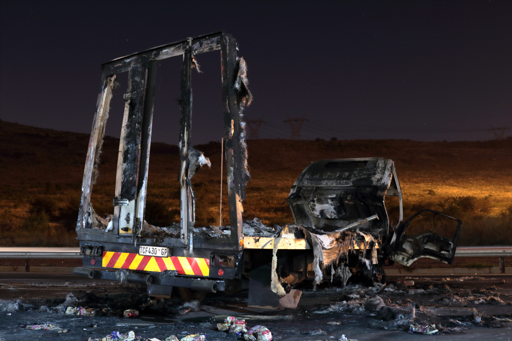

> **Plate 4 · `_MG_0800`**
> Burnt delivery truck, highway outside the city, 22 June 2016, 01:45.

It runs the other way as well. A delivery truck burnt to its frame at twenty to two in the morning, its load cooked across two lanes, the pylons still walking the hill behind it, indifferent and fully operational. Somebody withdrew a service. Somebody burned a delivery. Somebody's grievance was real, and the vehicle it landed on was a working part with a number plate.

The truck is the same object in both sentences.

---

## Harvest

Decay is not only a noun, and as a verb it has a subject.

Under the staircase, the cable. Insulation cooked off in a shallow gully, copper lifted out, sold. Somebody's Sunday spent crouching in smoke for a few hundred rand and perhaps a burn on the forearm.

Call it what it is: the configuration dismantled to liberate the substance. Making, run backwards, at a worse rate. Everything that went into laying that cable (the trench, the survey, the shift, the sign-off, the whole banked argument) cashed out as scrap.

*Verval.*

Noun and verb in the same six letters, and the word alone declines to tell you which it is.

Some subjects are easy to name because they arrive wearing municipal logos, development plans, quarterly reports. Some are harder because they arrive as need. The person burning cable is not the field that made copper worth burning and a city worth leaving. To collapse them is dishonest. To pretend they do not touch is also dishonest.

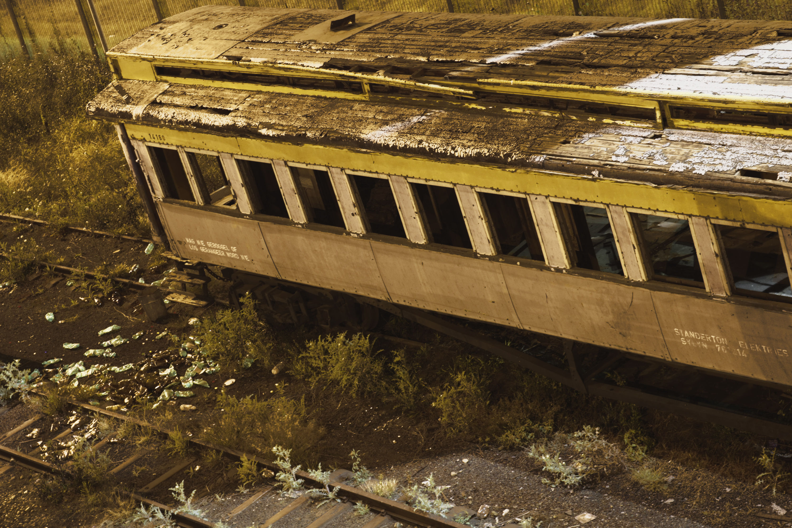

> **Plate 5 · `MagNieGeboggelWordNie(StandertonElektries_2016)`**
> Braamfontein, 5 June 2016, 00:19.

A carriage on a dead siding, stripped to its ribs, roof flaking under electric yellow. Along the flank a stencilled text is still legible: an instruction, in Afrikaans, about how this vehicle may not be hump-shunted or loose-shunted. Basically we are told in official type - the carriage should not be let go of. The rule outlived the institution that meant it. Strictly, nobody now obeys it. Nobody has bothered to deface it either. It goes on being a rule, on the side of a thing, in the dark. A thing that had been let go of, and yet not, for there it is 'ongeboggeld'.

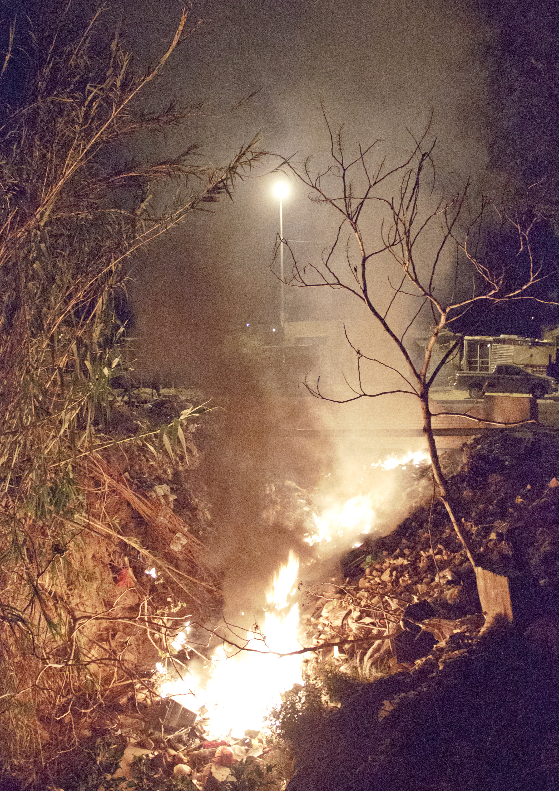

> **Plate 6 · `DiepslootRefuseFire(ASClem_2015_10_08_1344_take2)`**
> Diepsloot, 8 October 2015, 22:50.

And the fire, always the fire. Refuse burning down along a donga at ten to eleven at night, with the streetlight above it working perfectly.

That last fact is the one to keep. Nothing in the frame permits the clean story. The light works. The fire burns. A field can stay bright in one place while withdrawing one metre away, and the city is good at this. So are we.

---

## The window

Now the window.

It is in the frame at the top and again at the bottom, and it is slightly greasy. Four seconds would have cropped it out.

It is there because some months earlier I had neglected a usual safety protocol and paid a price involving being beaten for the camera: Hillbrow, the early hours of the second of January.

One night is not a life.

What I had gone out to photograph that night was darkness. Specifically: the parts of the city blacked out by load-shedding, the grid withdrawing on a schedule, a field switched off. I got good material on the outskirts, and then the inner city did what the inner city does to me, and I went in. Early mornings are in some ways the safest hours to work in these spaces, provided you hold situational awareness, visibility, distance. I let all three go for a composition I wanted. For a silly moment I disrespected the city.

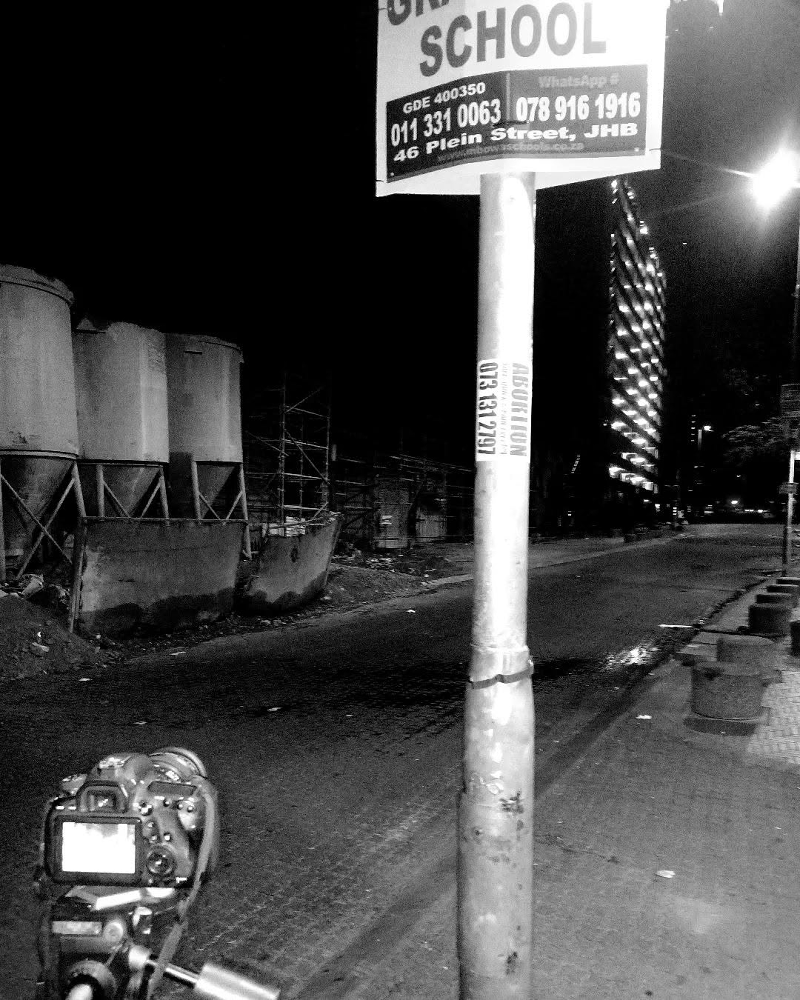

> **Plate 7 · `school_hillbrow`**
> Johannesburg, undated. A camera on its tripod on the pavement, screen lit. A school's board overhead, GDE registration and two numbers; a phone number for an abortion pasted to the pole below.

A phone snapshot of the camera that was about to be taken. The city casually announced I was about to get some 'SCHOOL'ing.

To photograph a ruin is to weigh it in a field which possibly the people inside it cannot afford. Here the window is me trying to say so. It is not a defence. It is a declaration of position, and it costs the frame something, which perhaps is the point. Let me frame it through an older photograph.

---

## The boys

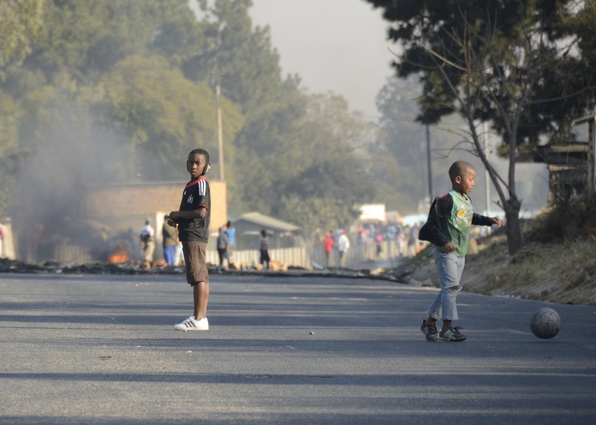

> **Plate 8 · `Zandspruit_Ballgame_2012_DSC6875`**
> Zandspruit, 13 June 2012, 15:26.

A road closed by a barricade, and because it is closed it is a pitch. Two boys and a ball on the best open space that afternoon - probably the only open space for miles (Zandspruit population density was already > 31,000 people per square kilometre back then). Fire low across the lane behind them, smoke into the trees, a crowd along the fence going about the business of being a crowd. The ball is mid-roll. The younger boy is following it the way you follow a thing you are about to be responsible for. The older one has turned, and is looking straight down the lens.

He is identifiable. I will not pretend that is a small thing.

I generally claim to not photograph people in spaces that read to me as decay, but it is not a simple issue. I can try to claim that I don't want to benefit from others' misery, which might convince some critics some of the time, but only respecting the person when you recognise them in a frame is itself a kind of violent flattening. So, no, a child there and then cannot audit that bargain, and this picture has outlived the afternoon by a decade and more, and neither objection goes away.

Avoidance is also an omission. Keep the child out of the argument and you keep childhood out of the city the argument claims to read: the clean unpeopled stair, the empty ruin, a Johannesburg in which nobody plays. That may be a quieter picture, and quieter is not the same as kinder. Kinders moet gesien word, EN gehoor word.

Context matters, as far as I am concerned these boys are not a misfortune I am harvesting. The barricade is behind them and it is not on them. The road did not become a pitch despite the trouble; it became a pitch because of it, and the taking of it is theirs, and victory of sorts. Let them have some.

And context is the first thing a photograph sheds. Captioned, he is a boy playing ball on a closed road. Uncaptioned, in a room I will never enter, he is evidence of whatever that room already wanted to see. I cannot follow the picture. I can only load it before it goes.

What does the photograph ask of the person inside it, what does it give back, and would he recognise himself in the sentence I have just written: a young man now, somewhere, who once owned a piece of road for a while.

---

## The green

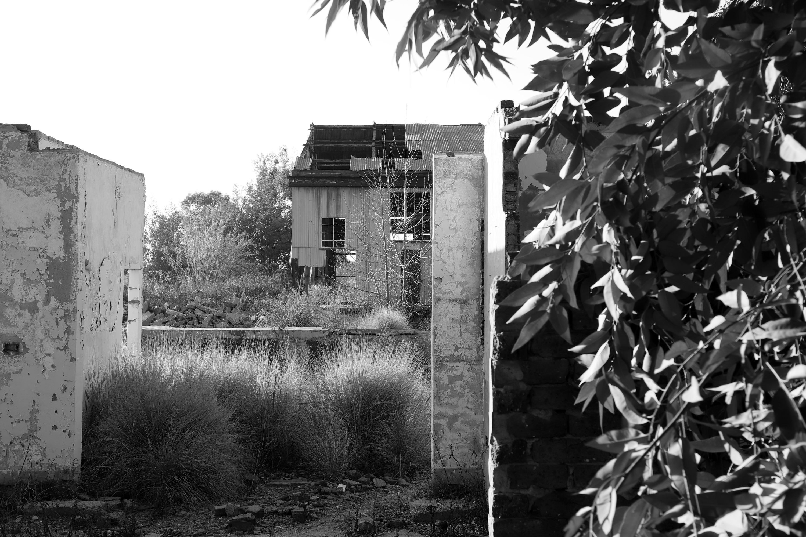

> **Plate 9 · `Durban Deep_2021(FNMBJ_Jul21_MG_0887)`**
> Durban Deep, West Rand, 17 July 2021, 16:37.

Then the green comes in over the top of the frame without permission.

Grass standing in the doorway, a tree through the roof sheet, the plan of the building still perfectly readable underneath, because a wall goes on being a wall long after it stops being a room. Something else has started weighing this, on a scale the original owner never held and could not have read. The termites of Durban Deep, following the implosion of state support and corporate interest around 2000, are enthusiastic.

The green is allowed its beauty. It is not allowed to solve the picture. It might be hope. It might be neglect with chlorophyll.

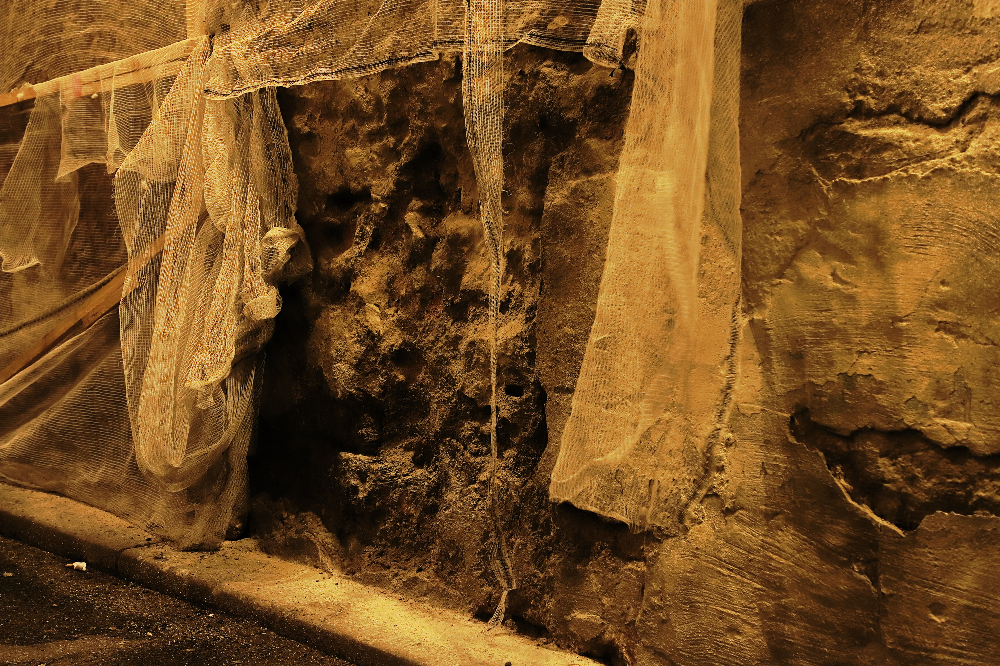

> **Plate 10 · `FacesinBordeaux_2019_MG_6016e`**
> Bordeaux, France, 26 April 2019, 22:30.

Look carefully and you start seeing faces. Everybody does. There is nobody in that wall, old and damp and hung with netting, and yet a face appears, because a face is what we are equipped to find. What a thing is made of is one question. What looking is, is another, and keeps moving.

---

## The gold

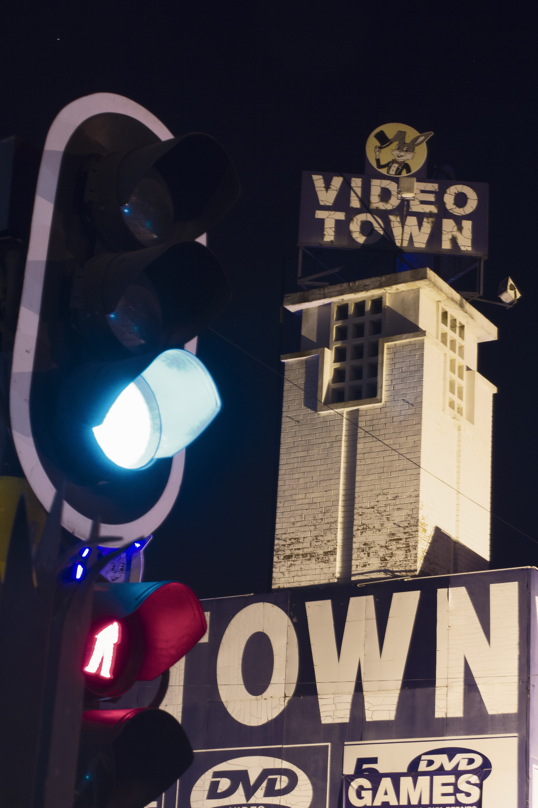

> **Plate 11 · `OWN-tower(2014_07_30_1459_tmp)`**
> Johannesburg, 30 July 2014, 22:54.

The gold left long ago and the streets still bend around where it was. Main Reef Road runs where the reef ran. The strung-out shape of this whole place is an ore body nobody has touched in a lifetime, and everything afterwards travels the bent line and calls the bending *the way to town*.

The small ones go the same way. A repurposed church tower with VIDEO TOWN bolted to the top of it, a rabbit in a top hat, DVD GAMES. Not one part of that has stopped existing, and yet. What went is a world in which a person drove somewhere on a Friday to rent a film and bring it back on Sunday to return it.

---

## The wall

There is no plate for this one, which is itself the finding.

I grew up in the suburbs, and what I did there was walk. Pick a direction and go: over the wall between one property and the next, along the top of it, down into somebody's yard and out the other side. That was ordinary. A child doing it now would probably meet barbed wire, an electric strand, a response vehicle, possibly a firearm discharge.

Nobody calls that decay. The houses are maintained. The gardens are watered. Property values have held, perhaps not well but we still have leafy suburbias.

Decay. In one direction the obvious fruit of abandonment, in another more aesthetically pleasing fortification, and in both a street that used to be crossable is no longer. Suburb decay into security, which photographs as nothing at all.

---

## Elsewhere

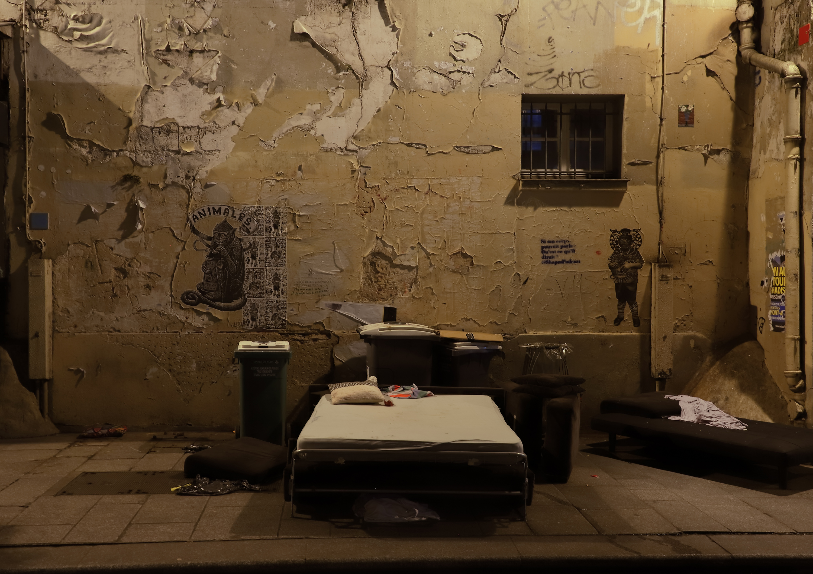

> **Plate 12 · `Midnight(Paris 2019)`**
> *Midnight.* Paris, 4 May 2019, 00:00:41.

A bed on the pavement, seems almost made up, as if pillow squared, clothes folded, occupant just momentarily absent, bins standing guard. Waiting for those trucks, but only slightly different ones.

It is here because this is not a local speciality. Withdrawal is a thing fields do everywhere, and the wealthy ones do it more quietly, under better lighting. In Bordeaux, eight days earlier, I thought I recognised a face in a wall coming apart under netting, and nobody called that a decaying city. Yet it all decays at the ordinary rate.

---

## The last frame

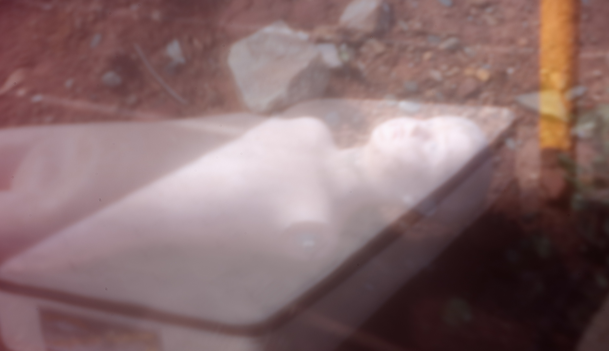

> **Plate 13 · `EventHorison(aPinhole-Poem)[pinhole_on_digital-doubleExposure-2017-2026]`**
> *Event Horison (a pinhole poem).* Pinhole on digital, double exposure, 2017–2026.

A pinhole lens on a digital camera, two exposures superimposed. A mattress abandoned in Bryanston, a mannequin on a landfill, it will not quite resolve. I have stopped needing it to for the most part.

See. Mass that persists can always be re-weighed, and never only on the original owner's scale. The building does not know it has been abandoned. Goud Street does not know the gold is gone. The copper is worth exactly what the copper is worth.

A ruin can be a wound, a shelter, a resource, a danger, a playground, a studio, a market, an archive, a warning, a home. The same structure, weighed in rooms that will never agree. Concern behaves like weather when you are caught inside it, but it is not weather: it has budgets, names, hands. A field withdrawn by us can be returned by us, and fought over by us, and the fight sometimes is what we call city.

The garbage trucks stopped coming, and when they came back the whistles were beautiful.

Not that the trucks had changed. Not really.

The field had.

*Verval.*

---

*Photographs and text: André S Clements.*

*Canonical text: [https://github.com/AndreClements/README/blob/main/docs/essays/urban_decay_is_a_verb.md](https://github.com/AndreClements/README/blob/main/docs/essays/urban_decay_is_a_verb.md)*

*Colophon: [https://github.com/AndreClements/README/blob/main/docs/essays/urban_decay_is_a_verb__colophon.md](https://github.com/AndreClements/README/blob/main/docs/essays/urban_decay_is_a_verb__colophon.md)*
