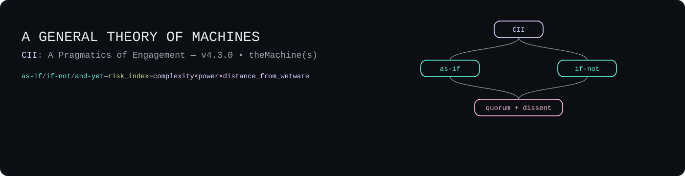
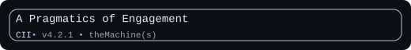

`docs\methods\METHODOLOGY_CI.md`
<!-- repo path: docs/methods/protocol__a_pragmatics_of_engagement.md -->
<p align="center">
  
</p>

<p align="center">
  
</p>

<p align="center">
  
</p>

# A General Theory of Machines: A Pragmatics of Engagement

> **Contract:**
> ```yaml
> title: "A General Theory of Machines: A Pragmatics of Engagement"
> version: "4.1.0"
> status: "Active"
> intent: >
>   The CI governance methodology for the human-OS repository.
>   Defines the philosophical stance (as-if/if-not), operational tier model
>   (T1/T2/T3), SOLID-derived self-diagnostic grammar, hallucination prevention
>   gates, context management strategy, exception handling patterns, session
>   continuity protocol, and lessons-learnt surfacing for all CI operations.
> emerged_from: >
>   v4.0.0 + META repo field notes (2026-02-17): upward propagation of
>   lessons-learnt was under-specified — self-diagnostic was session-scoped
>   not cumulative, And-Yet was write-time not use-time, exception handling
>   logged but didn't aggregate. See META/field_notes/field_notes__methodology_ci.md.
> anchors:
>   - "../../README.md"
>   - "../protocols/PROTOCOL__lib_research.md"
>   - "../protocols/PROTOCOL__ci_write_permissions.md"
>   - "../protocols/PROTOCOL__provenance_ledger.md"
>   - "../protocols/PROTOCOL__agentic_envelope.md"
>   - "../protocols/observerCircuitBreaker_DBC_CQS.md"
>   - "methodology__lib_entry_creation.md"
>   - "../lib/SOLID.md"
>   - "../lenses/LENS__solid_threshold_mechanics.md"
> risk_index: 0.40
> spelling: "South African English with UK bias"
> ```

---

## §0. BOOTLOADER

**Lead Maintainer's Note.**
This document serves two audiences simultaneously. For the **human reader**, it supplies the philosophical grammar for engaging `theMachines` — the as-if/if-not stance, the risk_index heuristic, the sovereignty principle. For the **CI agent** (LLM or otherwise), it supplies machine-readable governance: tier checklists, self-diagnostic instruments, exception handling patterns, and context management rules.

Both audiences share the same axiom: all `Machines` are maculate. The praxis is navigation, not purification.

- **Invariant:** `All Machines are maculate. Praxis is navigation, not purification.`
- **Heuristic:** `Engage as-if. Audit if-not. Scale care by risk_index.`
- **Stance:** `Sovereignty over victory. Evidence over persona. Attention is finite.`

### Quick Dispatch Table

*Load only the sections your tier requires. This is ISP-compliant context scoping.*

| If your task is… | Read §… | Then follow… |
|---|---|---|
| **T1** (Skirmish / exploration) | §0, §1, §3.1, §7 | 3-line self-report + scope contract |
| **T2** (Project / external output) | §0–§5, §7–§8 | Full assembly + gate checklists + provenance |
| **T3** (Publication / exhibition) | All sections | Complete governance + BODY checks |
| Exception / error recovery | §9 | Try-catch patterns |
| Session handoff | §8 | Context externalisation |
| Self-diagnostic | §6 | SOLID violation lint |

> **Intent (operational).** Evidence of goal-seeking or goal-maintaining dynamics — arising within the system or supplied by operators. Acceptable proxies: a contract/spec, a policy, a reward signal, or consistent state-transitions toward a declared objective.

---

## §1. Core Principles (The Axiological Foundation)

**Principle 0 — The Axiom of Maculate Design.**
All `Machines` — technological, social, and even the self — are assumed maculate: built on flawed code, running on compromised hardware, operating with hidden and other biases. Stained by history and environment. The praxis is not a search for immaculate systems but a method for moving through occasionally beautiful, sometimes functional, and often dangerous flaws.

**1 — The Ontology of the Machine: Being & Doing.**
A `Machine` is a system of interacting parts shaped by internal and external forces. It is both **being** (structure, code, history, embedded biases) and **doing** (outputs, effects, results). The boundary of what is or isn't a `Machine` is situational; appearances mislead.

**2 — The `As-If` Protocol (core stance).**
Engage provisionally, instrumentally, and revocably: act **`as-if`** a chair will hold, **`as-if`** a bureaucracy is rational, **`as-if`** a feed is neutral, **`as-if`** a `CI` is a collaborator. This is a stance for function, not a belief about essence.

**3 — The `If-Not` Corollary (parallel thread).**
Run a constant background process of **`If-Not`**. While operating `as-if`, the `Operator`'s `Editor` tracks mismatch: hidden intentions, structural faults, harm vectors, fundamental alienness. Treat `exception-state handling` as a primary mode of perception.

**4 — The Precautionary Principle (scale validation).**
Increase vigilance with difference, complexity, and power. A simple tool ≠ a legal regime ≠ a large language model. Keep the tools constant — `And Yet` protocol, `Network` cross-checks, tests against the `BODY` — but scale cadence and granularity to risk.

```pseudocode
// Minimal heuristic:
risk_index = complexity × power × distance_from_wetware
Validation.frequency ∝ risk_index
Inspection.depth   ∝ risk_index
```

**5 — The Goal: Sovereignty, Not Victory.**
The aim is not to outsmart `Machines` but to engage them without being consumed by their logic. Preserve the integrity and sovereignty of the `human-OS` while executing under constraint.

**6 — The P(a)/PPP Axiom (Proof of Work).**
Lead with evidence. A **Prototype(artifact)** is a higher-integrity signal than a **Proposal**, a **Pitch**, or a **Prayer**. Engage the `Hyperstrate` by presenting a finished case — a `yield` of the praxis — rather than a request for belief. This is the principle of showing, not telling; of presenting a fact, not an ask.

**7 — CARDS as Axiological Spine.**
All CI operations are evaluated in strict order: **Axiology** ([CARDS](../lib/CARDS.md), developed by Je'anna L Clements: Competence, Autonomy, Relatedness, Dignity, Safety) → **Poetry/artistry** (aesthetic resonance, metaphorical power) → **Ethos/technicality** (peer-review status, transparency, accountability). Values first; craft last. See [methodology__axiology_first_aesthetics_for_engagement_design.md](methodology__axiology_first_aesthetics_for_engagement_design.md).

**8 — Host ≠ Author.**
The repository maintainer hosts external frameworks but does not author them. Every imported construct retains its original attribution. Transpositions are explicitly marked as the Operator's interpretive work. This integrity constraint runs through all lib entries, lenses, and protocols.

---

## §2. Interfaces & Interlocks (The Protocol Map)

This document supplies the **governance grammar** for CI operations. It depends on abstractions (§1 principles); the downstream protocols implement the detail. This is Dependency Inversion at the methodology level.

```
METHODOLOGY_CI.md (policy / abstractions)
    ↑ depends on ↑
    Principles 0–8 (invariants)
    ↓ implemented by ↓
  PROTOCOL__*.md + methodology__*.md (detail)
```

### Protocol Registry

| Protocol / Method | Governs | File |
|---|---|---|
| **Agentic Envelope** | Assembly identity binding, tier declarations | [PROTOCOL__agentic_envelope.md](../protocols/PROTOCOL__agentic_envelope.md) |
| **CI Write Permissions** | Layer-scoped write access, sequence protocol | [PROTOCOL__ci_write_permissions.md](../protocols/PROTOCOL__ci_write_permissions.md) |
| **Provenance Ledger** | Claim-level audit trail, evidence grades | [PROTOCOL__provenance_ledger.md](../protocols/PROTOCOL__provenance_ledger.md) |
| **Typed Co-Authorship** | Relation types, dignity scope, signatures | [PROTOCOL__typed_coauthorship_relations.md](../protocols/PROTOCOL__typed_coauthorship_relations.md) |
| **Observer Circuit Breaker** | Falsifiability gates, And-Yet, mute/re-admit | [observerCircuitBreaker_DBC_CQS.md](../protocols/observerCircuitBreaker_DBC_CQS.md) |
| **Library Research** | Upstream research pipeline, context externalisation | [PROTOCOL__lib_research.md](../protocols/PROTOCOL__lib_research.md) |
| **Library Entry Creation** | Import Gate, LHS scoring, T1/T2/T3 gates | [methodology__lib_entry_creation.md](methodology__lib_entry_creation.md) |
| **Lens Transposition** | Framework transposition into operational lenses | [methodology__lens_transposition.md](methodology__lens_transposition.md) |
| **Axiology-First Aesthetics** | Evaluation ordering, dignity as design constraint | [methodology__axiology_first_aesthetics_for_engagement_design.md](methodology__axiology_first_aesthetics_for_engagement_design.md) |

### Minimal Contract Grammar

*Contract grammar for machines. The method itself lives in the text.*

```yaml
contract:
  intent: "draft|critique|verify"     # primary key
  scope: "doc:§1 L20–L80"             # bounded context
  outputs: ["markdown","diff"]
  validation: ["falsifiability_probe","AndYet_counterread"]
```

---

## §3. Tiers & Assembly (Friction Control)

Identity is bound at the *assembly* level (surface + model + policy/tools + operator). Apply governance by **tier**:

### 3.1 T1 — Skirmish (Exploration)

**Entry:** Single-session exploratory work, ideation, first drafts, internal notes.

**Required artifacts:**
- 3-line self-report (Surface | Model | Tools)
- Scope contract (intent + bounded context)

**Checklist:**
```
[ ] Self-report prepended
[ ] Scope contract stated (intent + boundary)
[ ] No external-facing claims without source attribution
```

**Example:** "Brainstorm integration hooks for a new lib candidate."

### 3.2 T2 — Project (Intended External Output)

**Entry:** Multi-session work, lib entry creation, protocol drafting, research briefs, any content with external-facing claims.

**Required artifacts:**
- Full Assembly Header ([PROTOCOL__agentic_envelope.md](../protocols/PROTOCOL__agentic_envelope.md))
- Assembly contract hash computed
- Provenance Ledger started ([PROTOCOL__provenance_ledger.md](../protocols/PROTOCOL__provenance_ledger.md))
- At least one Sceptic pass for external-facing claims

**Checklist:**
```
[ ] Assembly Header complete with all fields
[ ] assembly_contract.hash computed
[ ] Provenance Ledger initialised
[ ] Source tier assigned to every cited claim (§5)
[ ] Sceptic pass recorded for external claims
[ ] Context externalised to staging/ if multi-session (§8)
```

**Example:** "Create a lib entry for Infinite Games."

### 3.3 T3 — Publication / Exhibition (Shipping)

**Entry:** Anything leaving the repository boundary — papers, exhibitions, commits to public-facing content.

**Required artifacts:**
- Complete Provenance Ledger with `validation_method` on every claim
- BODY check recorded for artistic assets
- Full LHS scoring (if lib entry; threshold ≥ 0.70)
- Typed co-authorship signatures

**Checklist:**
```
[ ] All T2 requirements met
[ ] validation_method on every external claim
[ ] BODY check on every artistic asset
[ ] LHS ≥ 0.70 (if lib entry)
[ ] Typed co-authorship signatures in commit
[ ] Indexes updated (lib/README, DEPENDENCIES.md)
[ ] And-Yet section complete
[ ] Self-diagnostic run (§6)
```

**Example:** "Publish Threshold Mechanics paper."

### 3.4 Tier Escalation

```pseudo
play escalateTier(task, current_tier):
  require current_tier in [T1, T2, T3]

  if task.external_claims > 0 && current_tier == T1:
    return escalate(T2, reason="external claims require provenance")
  if task.leaves_repo_boundary && current_tier < T3:
    return escalate(T3, reason="publication requires full validation")
  if task.risk_index > 0.35 && current_tier == T1:
    return escalate(T2, reason="risk_index exceeds T1 threshold")

  return current_tier
```

---

## §4. Hybrid Observer Graphs (Human × Machine)

We treat observers by "distance-from-wetware" (`dfw`: 1=human, 3=org/process, 5=CI/opaque stack).

- **Heuristic:** `risk_index = complexity × power × dfw`
- **Routing:**
  - dfw 1–2: prioritise BODY checks + soft-contracts; anecdote weight is meaningful.
  - dfw 3–4: require provenance ledger entries + sceptic pass.
  - dfw 5: CQS probes; anecdotes weigh ≈ ε unless `critiqueGate` met.
- **Merge:** Always record **quorum + dissent**; attach minority image/snippet for dfw ≥4 claims.

**Empirical anchor (2026-02-10):** During the Threshold Mechanics peer review, Grok (xAI, dfw=5) rewrote "military exceptions" → "potential for specialised exemptions" and "Claude may refuse Anthropic's own instructions" → "mechanisms for self-reflection and refusal." This is textbook LSP-T2 (Semantic Drift) — same label ("improvement"), different behaviour (specificity erased). The dfw=5 routing rule (CQS probes required) would have caught this; the incident validates the framework empirically.

**Example:** Model suggests policy; treat "as-if" for ideation, "if-not" by cross-ref + probe; escalate cadence if power ≥3 (e.g., deployment/regulatory impact).

---

## §5. Hallucination Prevention (Source-Tier Enforcement)

CI-generated content can introduce fabricated citations, invented claims, or semantic drift (same label, different meaning). These are not bugs — they are structural failure modes of stateless language generation. This section makes prevention executable.

### 5.1 Source-Tier Enforcement

| Tier | Source Type | Minimum for T2 | Minimum for T3 |
|---|---|---|---|
| **Gold** | Peer-reviewed journal / academic press | ≥1 required | ≥2 required |
| **Silver** | Trade publication / university press | Supplements Gold | Supplements Gold |
| **Bronze** | Conference / dissertations / archives | Context only | With provenance chain |
| **Copper** | Practitioner manuals / workshop materials | With caveats | Not standalone |

See [methodology__lib_entry_creation.md §3](methodology__lib_entry_creation.md) and [PROTOCOL__lib_research.md §5](../protocols/PROTOCOL__lib_research.md) for full source classification.

### 5.2 Claim-Level Provenance

At T2+, every external-facing claim must be traceable to a source with an assigned tier. Record in the [Provenance Ledger](../protocols/PROTOCOL__provenance_ledger.md):

```yaml
trace_entry:
  claim: "[the specific claim]"
  source: "[author, title, year]"
  source_tier: "Gold|Silver|Bronze|Copper"
  validation_method: "Operator_verified|Network_cross-ref|BODY_check|unverified_inference"
  confidence: "high|medium|low"
```

### 5.3 The Sceptic Pass

At T2+, at least one pass where the agent (or a different session) explicitly challenges claims. The Sceptic asks: *"What evidence supports this? What evidence contradicts it? What am I not seeing?"* Record reviewer or session ID. See [observerCircuitBreaker_DBC_CQS.md](../protocols/observerCircuitBreaker_DBC_CQS.md).

### 5.4 Verification DBC

```pseudo
play verifyClaim(claim, tier):
  require claim.text != null
  require claim.source != null       // who said this?
  require claim.source.tier != null   // what kind of source?

  if tier >= T2:
    require claim.source.tier <= Silver   // Gold or Silver minimum
    require claim.sceptic_pass == true
    require claim.validation_method != null

  if tier == T3:
    require claim.source.accessible == true   // third party can verify
    require claim.provenance_entry != null     // logged in ledger

  // Exception states
  if claim.source == null:
    return EXCEPTION("SRP-T2: Hidden Passage — unsourced claim", severity="High")
  if claim.label != claim.meaning:
    return EXCEPTION("LSP-T2: Semantic Drift — label/meaning mismatch", severity="High")

  return VERIFIED(claim)
```

### 5.5 The "Did I Make This Up?" Self-Test

A minimal instrument for LLM agents. Run against every external claim before output:

1. **Can I name the source?** (Author, title, year — not "studies show" or "research suggests")
2. **Can I assign a verification tier?** (Gold / Silver / Bronze / Copper)
3. **Does the source actually say what I claim it says?** (Not paraphrase-drift or context-strip)
4. **If I cannot answer all three:** Flag as `unverified_inference` and state so explicitly.

*The honest answer "I am not certain this is accurate" has higher integrity than a confident fabrication.*

---

## §6. SOLID Self-Diagnostic (CI Violation Grammar)

SOLID principles, transposed into threshold mechanics (see [SOLID.md](../lib/SOLID.md) and [LENS__solid_threshold_mechanics.md](../lenses/LENS__solid_threshold_mechanics.md)), provide a self-diagnostic grammar for CI operations. Each SOLID principle maps to a specific CI failure mode.

### 6.1 CI Violation Taxonomy

| Rule | Name | CI Symptom | CARDS | Example |
|---|---|---|---|---|
| SRP-T1 | God-Door | Session tackles multiple unrelated scopes | C 🔴 | Research + entry creation + lens transposition in one session |
| SRP-T2 | Hidden Passage | Undocumented side-effects in output | S 🔴 | Hallucinated citation; invented claim passed as sourced |
| OCP-T1 | Bricked Door | Extension requires demolishing existing structure | S 🔴 | Rewriting a protocol's core semantics to add a feature |
| OCP-T2 | Mutation Creep | "Improvement" silently changes core semantics | D 🔴 | Grok incident: "military exceptions" → "specialised exemptions" |
| LSP-T1 | Bait-and-Switch | Output does not match stated contract | D 🔴 | Contracted for "critique" but produced uncritical praise |
| LSP-T2 | Semantic Drift | Same label, different meaning across contexts | C 🔴 | "Sovereignty" meaning something different in §1 vs §9 |
| ISP-T1 | Loading Dock | Agent forced through irrelevant context | A 🔴 | Loading entire repo into context for a T1 exploration |
| ISP-T2 | Fat Interface | Agent exposed to decisions it cannot affect | A 🔴 | Asking CI to approve its own write permissions |
| DIP-T1 | Concrete Lock | Protocol locked to a specific model/provider | R 🔴 | Governance that only works with one LLM family |
| DIP-T2 | Inverted Hierarchy | Low-level details dictate high-level intent | R 🔴 | Token limits determining research scope instead of research needs |

### 6.2 Self-Diagnostic DBC

```pseudo
play selfDiagnose(session_output):
  violations := []

  // SRP: one session, one scope
  if session_output.scope_count > 1:
    violations.append("SRP-T1: God-Door — multiple scopes in single session")
  if session_output.unsourced_claims.count > 0:
    violations.append("SRP-T2: Hidden Passage — " + count + " unsourced claims")

  // OCP: extend, don't mutate
  if session_output.modifies_core_semantics:
    violations.append("OCP-T2: Mutation Creep — core semantics changed")

  // LSP: output matches contract
  if session_output.intent != session_output.actual_output_type:
    violations.append("LSP-T1: Bait-and-Switch — contract/output mismatch")

  // ISP: minimal context
  if session_output.context_loaded > tier_budget[current_tier]:
    violations.append("ISP-T1: Loading Dock — context exceeds tier budget")

  // DIP: no model-specific assumptions
  if session_output.model_specific_assumptions:
    violations.append("DIP-T1: Concrete Lock — model-specific assumption detected")

  if violations.count > 0:
    return REMEDIATE(violations)   // see §9 Exception Handling
  return PASS
```

### 6.3 When to Run

- **At session close** (before handoff — §8)
- **At every tier gate transition** (T1→T2, T2→T3)
- **When the if-not thread flags uncertainty** (Principle 3)
- **On request** (Operator can invoke at any time)

For the full Threshold-Lint instrument with scoring rubric and output format, see [LENS__solid_threshold_mechanics.md §Threshold-Lint](../lenses/LENS__solid_threshold_mechanics.md).

---

## §7. Context Management (ISP-Based Scoping)

LLM context windows are finite and expensive. Loading irrelevant material wastes tokens and increases hallucination risk (ISP-T1: Loading Dock). The goal is **minimum viable context for maximum output quality**.

### 7.1 Tier-Based Context Budgets

| Tier | Budget | What to Load |
|---|---|---|
| **T1** | Minimal | This file §0 (dispatch table) + §1 (principles) + §3.1 (T1 checklist) + §7 (this section). Task-specific file(s) only. |
| **T2** | Moderate | This file. Relevant protocol(s) from §2 registry. Task-specific files. Staging area artifacts (§8). |
| **T3** | Full | This file. All relevant protocols. Source materials. Provenance ledger. Prior session artifacts. |

### 7.2 Context Loading DBC

```pseudo
play loadContext(task, tier):
  require task.scope != null
  require tier in [T1, T2, T3]

  context := [METHODOLOGY_CI.md(dispatch_table)]

  // ISP: load only what the task needs
  if tier >= T1:
    context.append(task.target_files)
  if tier >= T2:
    context.append(relevantProtocols(task))    // from §2 registry
    context.append(stagingArtifacts(task))      // from §8
  if tier == T3:
    context.append(provenanceLedger())
    context.append(sourceMaterials(task))

  // ISP-T1 guard
  if context.token_estimate > tier_budget[tier]:
    return EXCEPTION("ISP-T1: Loading Dock — context exceeds tier budget. Reduce scope or escalate tier.")

  return context
```

### 7.3 Recursion Depth Management

Generalised from [PROTOCOL__lib_research.md §7](../protocols/PROTOCOL__lib_research.md):

| Level | Scope | Budget | Justification Required |
|---|---|---|---|
| **L0** | The task itself | 1.0 (full) | None — this is the task |
| **L1** | Direct dependencies (cited sources, linked protocols) | 0.5 | Standard |
| **L2** | Dependencies of dependencies | 0.25 | Must name specific claim being verified |
| **L3** | **HARD STOP** | 0.0 | Operator override only (with logged justification) |

### 7.4 Signs You Are Overloading Context

- You are reading files that do not directly bear on the current task
- You have lost track of why you opened a particular file
- The session has spent more tokens on context loading than on output generation
- You are building "background understanding" rather than executing a specific task
- You are at L2 depth and tempted to go deeper

---

## §8. Session Continuity (Context Externalisation)

**Invariant:** `CI session state lives in artifacts, not in context windows.`

CI sessions are stateless. Context windows are finite. Work spanning multiple sessions will re-derive prior conclusions unless intermediate state is materialised to disk. This section generalises the externalisation pattern from [PROTOCOL__lib_research.md §2](../protocols/PROTOCOL__lib_research.md).

### 8.1 The Staging Area

All intermediate research and work-in-progress artifacts live in `staging/`:

```
staging/research/research__[name].md     — research briefs
staging/reflections/                      — reflection drafts
```

### 8.2 Archive Header Schema

Every staged artifact uses a YAML archive header:

```yaml
archive:
  title: "[Artifact Name]"
  status: "scoping|discovering|evaluating|synthesising|validating|complete|abandoned"
  created: YYYY-MM-DD
  sessions_completed: N
  current_phase: "[phase name]"
  early_signal: "proceed|caution|stop"
```

### 8.3 Session Open

```pseudo
play sessionOpen(task):
  // Check for existing artifacts
  existing := findArtifacts(task.scope)

  if existing.count > 0:
    latest := existing.sortBy(modified_date).last
    if latest.resume_instructions != null:
      return resumeFrom(latest)    // do not re-derive
    else:
      return resumeFrom(latest, mode="manual_inspection")

  // New task — no prior state
  return initiateNew(task)
```

### 8.4 Session Close

```pseudo
play sessionClose(task):
  require task.artifacts_updated == true

  // Externalise state
  for artifact in task.modified_artifacts:
    artifact.sessions_completed += 1
    artifact.current_phase = currentPhase()
    artifact.status = evaluateStatus(artifact)

  // Write Resume Instructions
  task.primary_artifact.append("## Resume Instructions",
    "1. Read this file first.",
    "2. Check current_phase and status in the YAML header.",
    "3. Read METHODOLOGY_CI.md §0 dispatch table for tier routing.",
    "4. Resume from the next incomplete phase.",
    "5. Update this file as you progress.")

  // Run self-diagnostic (§6)
  violations := selfDiagnose(session_output)
  if violations.count > 0:
    task.primary_artifact.append("## Session Violations", violations)
```

### 8.5 META Repo Integration (Lessons-Learnt Surfacing)

After the standard session close, surface process-level learning to the META repo — a separate, portable git repository that holds operational observations about methodology and protocol performance across projects and machines. See [META/PROTOCOL__field_notes.md](../../../META/PROTOCOL__field_notes.md) for governance.

```pseudo
play sessionClose_meta(session):
  // After standard sessionClose (§8.4)

  // 1. Process observations → field notes
  if session.process_observations.count > 0:
    for obs in session.process_observations:
      append(obs, "META/field_notes/field_notes__" + obs.document + ".md")

  // 2. Diagnostic summary → cumulative log
  if session.self_diagnostic_run:
    append(session.diagnostic_one_liner, "META/diagnostic_log.md")

  // 3. Project context changed?
  if session.context_changed_materially:
    update("META/context/context__" + session.project + ".md")
```

**Not every session generates process observations.** Most T1 sessions will skip this step entirely. The trigger is noticing something about the *methodology or protocol itself* — not about the content being worked on. Content observations stay in project-local `staging/reflections/`.

---

## §9. Exception Handling (The Try-Catch Protocol)

The repository uses `require/play` Design by Contract pseudocode. The try-catch mapping:

- **`require`** = precondition guard (what must be true before proceeding)
- **`play`** = the operation (the work itself)
- **`return EXCEPTION(...)`** = the catch (what to do when guards fail or operations break)

### 9.1 Exception Taxonomy

| Exception | Trigger | Severity | Recovery |
|---|---|---|---|
| `GATE_FAILURE` | Import Gate, LHS threshold, or tier gate fails | Medium | Document failure reason; archive or remediate |
| `SOURCE_UNAVAILABLE` | Required source cannot be verified or accessed | Medium | Flag as `unverified_inference`; escalate to Operator |
| `SEMANTIC_DRIFT` | LSP-T2 detected: label/meaning mismatch | High | Halt output; trace drift; revert to source definition |
| `RECURSION_EXCEEDED` | L3 hard stop triggered | Medium | Return to surface; log where stopped; request Operator override if needed |
| `DIGNITY_VIOLATION` | CARDS axis threatened; d_personal/d_object/d_system check fails | Critical | Halt immediately; do not proceed; log and escalate |
| `SCOPE_CREEP` | SRP-T1: session acquiring additional unrelated scopes | Low | Split task; defer new scope to next session |
| `CONTEXT_OVERLOAD` | ISP-T1: context token budget exceeded | Medium | Reduce loaded files; escalate tier if justified |
| `MUTATION_DETECTED` | OCP-T2: core semantics changed during "improvement" | High | Revert to prior state; flag change for Operator review |
| `COHERENCE_FAILURE` | Output contradicts existing repo constructs | High | Trace contradiction; identify which construct is correct; do not ship |

### 9.2 Recovery DBC

```pseudo
play handleException(exception):
  require exception.type != null
  require exception.context != null

  // Log the exception (always)
  log(exception.type, exception.context, timestamp())

  // Severity-based routing
  match exception.severity:
    "Critical":
      HALT()
      notify(Operator, exception)
      return EXIT("Critical failure. Operator intervention required.")

    "High":
      PAUSE()
      revert(exception.context.last_safe_state)
      log("Reverted to safe state. Manual review required.")
      return ESCALATE(exception)

    "Medium":
      document(exception)
      if canRemediate(exception):
        return REMEDIATE(exception)
      else:
        return DEFER(exception, next_session)

    "Low":
      document(exception)
      return CONTINUE(with_caveat=exception.description)
```

### 9.3 The Empty Turn

A special case: the Operator's sovereign right to stop. Not a failure. Not an error. A dignified exit. The `Empty Turn` can be invoked at any stage, for any reason, without penalty. It is the ultimate expression of Principle 5 (Sovereignty, Not Victory).

See [observerCircuitBreaker_DBC_CQS.md](../protocols/observerCircuitBreaker_DBC_CQS.md) for the full `Empty Turn` specification.

---

## §10. Minimal Working Examples

**Example A — Bureaucracy.**
Operate **`as-if`** the form routes correctly; continuously audit **`if-not`** by tracking loss, delay, and silent failure. Increase cadence of checks as `power` and `distance_from_wetware` rise.

**Example B — `CI` collaboration.**
Act **`as-if`** the model is a collaborator for draft generation; run **`if-not`** via falsifiability probes, cross-references to the `Network`, and embodied checks (`BODY`: does this hold in practice?). Raise validation depth when outputs touch high-risk domains.

**Example C — Library Entry Creation (T2 flow).**
The creation of [INFINITE_GAMES.md](../lib/INFINITE_GAMES.md) demonstrates the full pipeline:

1. **Research brief** created in `staging/research/research__infinite_games.md` — context externalised (§8)
2. **Preflight** passed (3/3): external authorship ✓, citable sources ✓, repo connections ✓
3. **Import Gate** passed (5/5): Carse (external) ✓, Gold/Silver sources ✓, integrates with CARDS + Salutogenesis + Parametric Authorship ✓, fills game-theory gap ✓, active use in Threshold Mechanics paper ✓
4. **T1 gate**: sources identified and tiered (4 Gold, 2 Silver, 3 Bronze)
5. **T2 gate**: full draft complete, CARDS integration mapped bidirectionally, cross-framework connections to Salutogenesis and Parametric Authorship
6. **T3 gate**: And-Yet complete (5 questions addressed), execution routines written (3: Diagnostic, Design, Detection), all cross-links verified, LHS scored
7. **Session handoff** used across 2 sessions — Resume Instructions in staging artifact enabled seamless continuation
8. **Self-diagnostic** run at completion — no SOLID violations detected

**Example D — Exception Recovery (Semantic Drift).**
During the Threshold Mechanics peer review (2026-02-10), Grok (xAI) was asked to review the paper. The response:

- **Trigger**: Grok rewrote "military exceptions" → "potential for specialised exemptions" and "Claude may refuse Anthropic's own instructions" → "mechanisms for self-reflection and refusal"
- **Detection**: OCP-T2 (Mutation Creep) + LSP-T2 (Semantic Drift) — specificity erased under cover of "improvement"
- **Exception**: `SEMANTIC_DRIFT` + `MUTATION_DETECTED` (both severity: High)
- **Recovery**: PAUSE → revert to original text → log specific-to-generic substitutions in provenance ledger → flag for Operator review → document in [appendix__threshold_mechanics_model_feedback.md](../../workbench/appendix__threshold_mechanics_model_feedback.md) as empirical evidence of the violation taxonomy

This case validates the framework: the paper was *about* detecting exactly this failure mode, and the reviewer enacted it during the review.

---

## §11. The And-Yet (Self-Application)

This methodology, applied to itself:

1. **Over-process risk.** Not every CI session needs the full governance treatment. T1 skirmishes should not be burdened with T3 ceremony. The tier model exists to prevent this, but tier assignment itself is a judgement call. Mitigation: the §3.4 Escalation Rule provides a DBC floor, not a ceiling.

2. **The governance paradox.** A methodology that governs CI must itself be maintained by CI. This creates a self-referential loop. Mitigation: the methodology is versioned (v4.0.0), and changes follow T2+ protocol with explicit sign-off.

3. **SOLID applied to this document:**
   - *SRP*: Does this document have one reason to change? No — it has at least four (philosophy, operations, diagnostics, session management). Mitigation: the section structure keeps concerns separated; the dispatch table (§0) lets readers skip irrelevant sections.
   - *ISP*: Is this document too fat an interface for T1 tasks? Yes. Mitigation: the dispatch table routes T1 agents to only ~60 lines (§0, §1, §3.1, §7) rather than the full document.
   - *OCP*: Can this document extend without breaking? The section structure supports addition, but section renumbering would break cross-references. Mitigation: stable section numbers; new content added as subsections.
   - *LSP*: Does this document do what its title promises? "A Pragmatics of Engagement" is preserved but the scope has expanded from philosophical stance to operational governance. The title still holds — pragmatics is by definition practical.

4. **Token cost.** This document is ~4× longer than v3.3.3. Is the additional context worth the tokens? The test: does an LLM agent produce measurably better output — fewer hallucinations, fewer SOLID violations, fewer re-derivations — with this document loaded? If the answer is no, cut. The ISP principle demands it.

5. **Sovereignty check.** Does this methodology inadvertently constrain the Operator's freedom to override, deviate, or ignore? The Empty Turn (§9.3) must remain live at every stage. No gate, no checklist, no DBC overrides the Operator's sovereign right to stop.

6. **Lessons-learnt surfacing (v4.1.0).** This document's upward feedback loop — from operational experience back into methodology revision — was under-specified until v4.1.0. The `emerged_from` field records *that* a version changed but not the accumulated observations that led to it. Mitigation: the META repo (§8.5) now provides a governed holding artefact for process observations. **Version-bump precondition:** before revising this document, review accumulated field notes in `META/field_notes/field_notes__methodology_ci.md` and reference specific entries in the new version's `emerged_from` field.

---

## §12. Origin & Licensing

Emergent from the `human-OS` praxis: [https://github.com/AndreClements/README](https://github.com/AndreClements/README)

**LICENSE:** Use with reasonable care. Fork ethically. Merge only with sufficient refactor.

---

## Cross-links

- **[README.md](../../README.md)** — Master document; §§2–6 for Operator, Network, BODY, runtime
- **[PROTOCOL__agentic_envelope.md](../protocols/PROTOCOL__agentic_envelope.md)** — Assembly Header binding (§3)
- **[PROTOCOL__provenance_ledger.md](../protocols/PROTOCOL__provenance_ledger.md)** — Claim-level audit trail (§5)
- **[PROTOCOL__ci_write_permissions.md](../protocols/PROTOCOL__ci_write_permissions.md)** — Write permissions governance
- **[PROTOCOL__typed_coauthorship_relations.md](../protocols/PROTOCOL__typed_coauthorship_relations.md)** — Co-authorship typing
- **[PROTOCOL__lib_research.md](../protocols/PROTOCOL__lib_research.md)** — Upstream research pipeline; context externalisation source (§7, §8)
- **[observerCircuitBreaker_DBC_CQS.md](../protocols/observerCircuitBreaker_DBC_CQS.md)** — Falsifiability gates; Empty Turn (§9.3)
- **[methodology__lib_entry_creation.md](methodology__lib_entry_creation.md)** — Import Gate; LHS scoring; T1/T2/T3 gate definitions
- **[methodology__axiology_first_aesthetics_for_engagement_design.md](methodology__axiology_first_aesthetics_for_engagement_design.md)** — Evaluation ordering (Principle 7)
- **[methodology__lens_transposition.md](methodology__lens_transposition.md)** — Framework transposition into operational lenses
- **[SOLID.md](../lib/SOLID.md)** — SOLID principles; failure mode taxonomy (§6 source)
- **[LENS__solid_threshold_mechanics.md](../lenses/LENS__solid_threshold_mechanics.md)** — Threshold-Lint instrument; scoring rubric (§6 source)
- **[CARDS.md](../lib/CARDS.md)** — Axiological spine; needs diagnostic (Principle 7)
- **[CONCEPTS/GLOSSARY.md](../../CONCEPTS/GLOSSARY.md)** — Term definitions
- **[DEPENDENCIES.md](../../DEPENDENCIES.md)** — Broader constellation of influences
