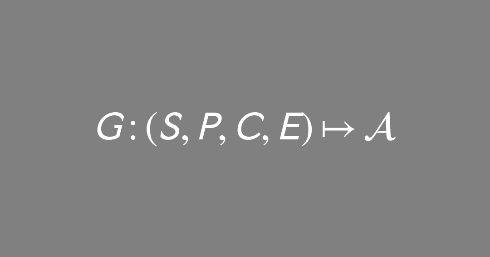
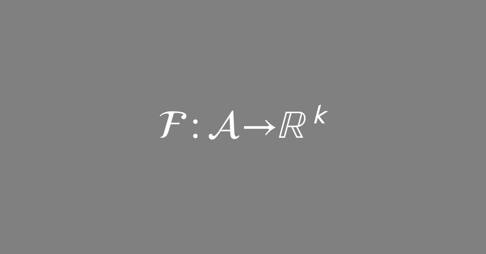
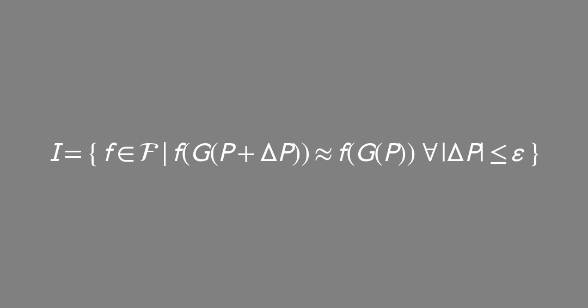
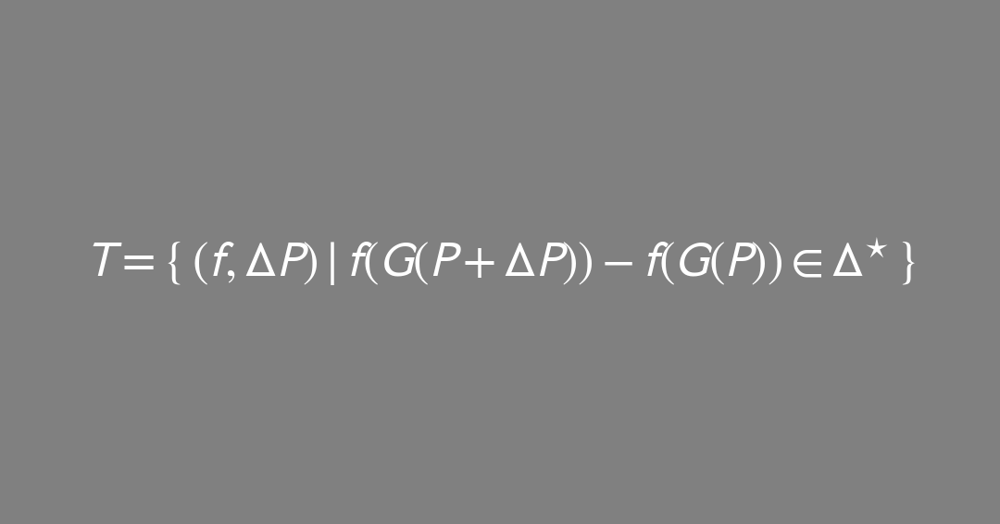

`projects/theses/parametric_authorship.md`
### **Thesis Prototype**

# **The Fourth Dimension as Execution**
## *A Formalisation of Parametric Authorship via the Hyperstrate, Semiological Ground, and Systemic Implications*

> Operates under the praxis in **../README.md** (canonical mirror: https://github.com/AndreClements/README/blob/main/README.md).  
> Style & axiology: *as-if / if-not*, maculate design, sovereignty over victory, scaled validation by risk_index.
> ```yaml
>contract:
>  intent: "doctoral thesis draft (practice-led, theory-bearing, SOLID)"
>  scope: "projects/theses/parametric_authorship.md"
>  validation: ["falsifiability_probe","AndYet_counterread"]
>  repository_binding:
>    base_rel: "https://github.com/AndreClements/README"
>    methods_rel:
>      - "../docs/methods/METHODOLOGY_CI.md"
>    protocols_rel:
>      - "../docs/protocols/observerCircuitBreaker_DBC_CQS.md"
>      - "../docs/protocols/protocol__agentic_envelope.md"
>      - "../docs/protocols/protocol__provenance_ledger.md"
>    dependencies_rel:
>      - "../docs/DEPENDENCIES.md"
> ```

# Abstract


> *A composite superposition of the core formalisms presented in this work.*

> **Plain-English abstract (120 words).**
> This thesis shifts authorship from “making a thing” to **designing rules** that reliably produce families of things. Meaning isn’t only in a finished picture or paragraph; it’s in the **mapping** from rules to outputs. I call the stack where rules live the **hyperstrate** (tools, defaults, policies). I formalise an author’s role as a **Parametric Author Function (PAF)**—the way a person shapes a system’s sensitivity to change—then test it in a real studio brief (Filmic Response A0). A small governance kit (assembly header, provenance ledger, circuit breaker) keeps dignity, consent, and refusal front-and-center. The result is a practice that privileges **decisions over spectacle**, and a critique method that measures **invariants** (what stays stable) and **designed transitions** (what changes on purpose).

**Working axioms: A0–A7 (see §2.5).**

**Parametric Authorship (PA)** recasts creative agency... from content inscription to **rule design across strata**. In a maculate, computationally entangled milieu, the decisional locus moves to constraints, ranges, contracts, and locks that shape families of outcomes. This work formalises: (i) the **Hyperstrate**—the superposed layer of tools, defaults, policies, logistics on which PA operates; (ii) a **Parametric Author Function (PAF)** modelling agency as sensitivity-shaping under contract; and (iii) a **Parametric Semiotic Triangle** in which meaning is borne by mappings, not tokens. A dignity-preserving governance stack (assembly header, agentic envelope, provenance ledger, circuit breaker) is specified and tested in a practice-led case (*Filmic Response* A0 intervention). The thesis argues that **execution is the fourth dimension of form**: agency proves itself by invariants under small perturbations and designed transitions under declared shocks.

# 1. Introduction — From Marks to Maps

Traditional authorship imagines a bounded maker inscribing determinate marks. **Parametric authorship** treats the authorial act as the **design of control surfaces**: articulate rule-sets, set ranges, fix locks; let a generator instantiate instances. Law, pedagogy, and critique remain token-centric; this produces analytical blind spots when outputs are **distributions** and agency is **upstream**.

**Research Questions**

1. What constitutes an authorial act where outputs are *families*, not singulars?
2. How does meaning stabilise when the sign vehicle is **generated under constraint**; what is the semiotic status of the constraint system?
3. Which governance/pedagogical protocols sustain **sovereignty, safety, dignity** when host defaults and opaque models are silent co-authors?

**Hypothesis (operational)**
Agency and meaning in PA are legible and defensible at the level of **rule specification, sensitivity control, and auditable provenance**. The critical unit is the **mapping** and its **stability under perturbation**.

# 2. Definitions & Scope

* **Hyperstrate.** The cross-cutting layer of influence—weights, datasets, UI affordances, platform policies, economics, rubrics, studio logistics—on/through which PA operates and where domain rule-design **impacts and affects** the work.
* **Parametric Author Function (PAF).** The authored tuple and shaping functional that constrain a generator.
* **Dignity (tri-scoped).** Personal (operator sovereignty), object (integrity of non-human participants), system (emergent integrity of the stack).
* **Maculate design.** Assume flaws and history in all systems; build protocols, not purity. *(cf. ../README.md)*

**Micro-glossary**

* **Invariant** — feature stable under small parameter nudges.
* **Designed transition** — intended feature change under declared shocks.
* **Empty Turn** — sovereign refusal to execute and/or allow extraction.
* **SOLID** — five object-oriented design principles (Single Responsibility, Open-Closed, Liskov Substitution, Interface Segregation, Dependency Inversion).\[^solid]

**Symbol legend (concise)**
`S,P,C,E` substrates, parameters, constraints, environment · `G` generator · `ℱ` feature extractor · `ε` small radius in `P` · `τ` exposure/extraction threshold · `α` transmissivity ∈ \[0,1] (1 − attenuation) · `κ` adapter map · `‖·‖` L2 norm unless stated.

## 2.5 Axioms (small)

> Compact invariants that bind the thesis across theory, governance, and studio practice.

* **A0 — Equation-as-Machine.** `equation ≡ language_machine`
  (A formal expression is an executable grammar; reading = running.)

* **A1 — Map-over-Mark.** `meaning := invariants(P → A)`
  (Meaning is borne by stable features of the mapping from parameters to artifacts.)

* **A2 — Execution-First Form.** `form₄ᴰ := (geometry, material, time, execution)`
  (The fourth dimension of form is execution; proofs live in runs, not statements.)

* **A3 — Dignity Conservation.** `let d := (d_personal, d_object, d_system) ∈ [0,1]³; D := diag(d); conserve(D)`
  (Sovereignty must be conserved across operator, object, and system scopes.)

* **A4 — Defaults Author.** `host_defaults ∈ S ⇒ author(S)`
  (Platforms, weights, and policies are co-authors unless disclosed and bounded.)

* **A5 — Withdrawal Right.** `∀ participant: hasExit(contract, participant) = true`
  (Refusal/exit is a first-class operation; no consent, no extraction.)

* **A6 — Provenance is the Indexical Trace.** `indexical_trace := ledger(commit_hashes, locks, deltas)`
  (The “stroke” in PA is the recorded decision and its hash.)

* **A7 — Dependency Inversion of Dignity.** `policies → abstractions; tools → adapters`
  (High-level authorial policies depend on declared **abstract interfaces**; concrete tools must conform via **adapters**. Dignity is enforced at the interface, not begged from implementations.)

**Corollaries.**
C1: `translation ≻ transplantation` (feature overlap ≤ τ).
C2: `merge := quorum + dissent` (minority views persist as first-class artifacts).

## 2.6 Delimitations (what this work does and does not claim)

* **Relations, not essences.** The framework addresses **relations of access** within a declared agentic envelope; it makes **no claim** to total access to objects.
* **Practice-led evaluation.** Evidence is drawn from the Filmic Response A0 case and controlled probes (host-switch, obstruction toggles, prompt perturbations); **industrial generalization is out of scope**.
* **Model-agnostic formalism.** Examples use image/drawing as an **ideogram**; the mathematics applies to text/audio/code *mutatis mutandis*.
* **Legal posture (descriptive, not prescriptive).** Legal doctrine appears only to **motivate assembly-level attribution and provenance**; this work **does not advance new legal theory** nor offer legal advice. Jurisdictional specifics are acknowledged but not analyzed in depth.

## 2.7 SOLID alignment (design contracts)

> The thesis architecture is engineered to respect SOLID at both code-level metaphor and protocol-level practice.

| SOLID principle           | In this thesis                                                                                                                                                         | Why it matters here                                                           |
| ------------------------- | ---------------------------------------------------------------------------------------------------------------------------------------------------------------------- | ----------------------------------------------------------------------------- |
| **Single Responsibility** | Each artifact/role has one reason to change: *Language Card* (rules), *Assembly Header* (context), *Ledger* (trace), roles D/A/E/LM (intent/access/discretion/filter). | Keeps authorship legible; decisions don’t leak across concerns.               |
| **Open–Closed**           | Protocols open to extension (add new obstructions, checks, hosts) but closed to modification of core invariants (locks, exits, ledger schema).                         | Extends practice without breaking prior proofs of dignity/sovereignty.        |
| **Liskov Substitution**   | Substrates (S) are substitutable if they implement required interfaces: header disclosure, refusal semantics, provenance hooks.                                        | Enables host/model swaps for perturbation tests without rewriting governance. |
| **Interface Segregation** | Small, purpose-built interfaces: *Language Card*, *Header*, *Ledger*, *Circuit Breaker*—no “fat” god-objects.                                                          | Practitioners implement only what they actually use; reduces coupling.        |
| **Dependency Inversion**  | High-level policies depend on **abstract interfaces** (header/ledger/exits), not concrete models; concrete tools adapt via ports/adapters.                             | Preserves sovereignty: policy governs tools, not vice versa.                  |

**Minimal interface sketch (ports/adapters)**

```pseudocode
interface Header { disclose_defaults(); context(); hash(); }
interface Ledger  { record(event); query(filter); export(); }
interface Exits   { has_exit(participant); empty_turn(); }
interface Host    { run(P); implements(Header, Ledger, Exits) }

fn execute(PAF, Host h):
  require h.disclose_defaults() && h.has_exit("*")
  h.record("locks", PAF.locks)
  return h.run(PAF.params)
```

# 3. Theoretical Framework

## 3.1 The Hyperstrate

Authorship is exercised **across** the hyperstrate by selecting substrates, exposing/occluding parameters, declaring contracts, and fixing locks. The relevant philosophy is anti-essentialist, **object-respectful**, and pragmatic: treat hosts, datasets, materials, and policies as **actants** with constraints that must not be collapsed to mere utility.

## 3.2 The Parametric Author Function (PAF)

Let $S$ be the substrate stack (tools/models), $P$ the parameter vector (rules/ranges), $C$ constraints (intent/obstructions), $E$ environment (budgets/governance). A generator $G:(S,P,C,E)\mapsto\mathcal{A}$ yields an artifact family $\mathcal{A}$.

Define the authored tuple:


where the admissible parameter space is $\mathcal{P}\subseteq\mathbb{R}^{n}$ and $\Phi$ is a **shaping functional** over sensitivities (e.g., $\Phi=\frac{\partial\mathcal{F}}{\partial P}$, with $\mathcal{F}$ a feature extractor on $\mathcal{A}$).


**Agency metric (intuition):**

![\$\operatorname{Auth}^{\star}=\left|\nabla\_{P}\mathbb{E}!\left\[\mathcal{F}(G)\right\]\right|\cdot\operatorname{Inv}(P!\to!\mathcal{F})\cdot R(C,E)\cdot\prod\_{i}d\_i\$](assets/parametric_authorship_equations_cards_mathtext/05_agency_metric.png)

where the dignity invariants $d_i$ are bounded as $d_i\in[0,1]$.

![\$d\_i\in\[0,1\]\$](assets/parametric_authorship_equations_cards_mathtext/06_d_bounds.png)

Define `Inv(P→ℱ)` as a normalised invariance score over the ε-ball in `P`, in `[0,1]` (see Appendix A: `I` set).
Define `R(C,E)` as a run-readiness/risk governor in `[0,1]` derived from declared constraints `C` and environment `E`.
Unless stated otherwise, `‖·‖` denotes the L2 norm.

## 3.3 Parametric Semiotic Triangle

Extend Saussure/Peirce to generated media:

* **Vertex 1 — Rule Manifold $\mathcal{P}$** (e.g., *Language Card* rules).
* **Vertex 2 — Generated Vehicle Family $\mathcal{A}$** (instances).
* **Vertex 3 — Interpretant Field $\mathcal{I}$** (audience inference of the mapping).

Meaning stabilises as:

* **Invariants:** features persistent under small $\Delta P$.
* **Designed transitions:** features that change predictably under intentional shocks.
* **Style:** curvature of $\mathcal{P}$ as perceived via $\mathcal{A}$ (how features bend to parameter movement).
* **Non-exhaustion premise:** The triangle models relations of access, not the object in full.

## 3.4 Dignity Across the Hyperstrate

Introduce a **dignity tensor** $\mathbf{D}$:


For clarity: let \$\mathbf{d}:=(d\_{\mathrm{personal}}, d\_{\mathrm{object}}, d\_{\mathrm{system}})\in\[0,1]^3\$ and define \$\mathbf{D}:=\operatorname{diag}(\mathbf{d})\$.

**Minimal invariants (run-time checks):**

* **Withdrawal allowance:** any participant may refuse extraction beyond scope.
  Test: `hasExit(contract, participant)==true`.
* **Default disclosure:** assembly header declares host/weights/policy/limits.
  Test: header present + versioned.
 **Extraction ceiling:** translation $>$ transplantation; surface overlap ≤ $\tau$.
  Test: `feature_overlap(A_final, source) ≤ τ`.
* **Reciprocal ledger:** record non-human impacts.
  Test: ledger includes `non_human_impact` rows at publish.

## 3.5 Dependency Inversion for Objects in the Wild (DIOW)

**Statement (adapted from SOLID’s DIP).**
High-level policies of authorship (sovereignty, provenance, refusal) **must not depend** on the concrete details of tools, platforms, or hosts. **Both** the policies and the tools depend on **abstractions** (a public contract). Tools engage only through **adapters** that satisfy this contract.

**OOO compatibility.**
OOO says objects are withdrawn. DIOW therefore renounces access to inner essences and binds interaction to **accessible surfaces** declared in an interface. We don’t “know” the object; we **negotiate** a boundary.

**Abstract Interface (AII).**
Our interface is the quartet already present in the praxis:
(1) **Assembly Header** (defaults disclosure) aka Dreamer
(2) **Provenance Ledger** (indexical trace) aka Analyst
(3) **Circuit Breaker** (sovereign exit) aka Editor
(4) **Dignity Linter** (run-time checks) aka Maintainer

**Formal hook.**
Let the generator be `G:(S,P,C,E)→𝒜`. Partition `S = S_impl ⊕ S_iface`.
Authorship acts on `S_iface` (the interface layer) and never assumes internals of `S_impl`. A **conformance map** `κ : S_impl → S_iface` (the adapter) must exist such that all obligations are discharged:

$$\forall,o\in S_{\mathrm{impl}}:; \texttt{Header}(κ(o))\wedge \texttt{Ledger}(κ(o))\wedge \texttt{Exit}(κ(o))\wedge \texttt{Lint}(κ(o)) .
$$

No `κ` ⇒ no engagement.

**Design consequence.**
Authorship = design of the interface + tests. Implementations come and go; the contract and its proofs persist.

## 3.6 Dependency Inversion on Cybernetics (Sovereign Interface)

**Claim.** Parametric Authorship applies **dependency inversion** to a classical cybernetic loop. High-level policy (A3–A7) is externalised as a public **Sovereign Interface**; concrete tools/hosts must conform via adapters `κ`. Refusal is an admissible control action.

### Classical loop (first-order)
Reference (implicit goal) → Comparator → Controller → Actuator → Plant → Sensor → (back to Comparator)

### Inverted loop (sovereign)
Policy `π` (A3–A7) → **Linter/Circuit Breaker** → `κ`-adapted Actuator → Plant (`S_impl`) → **Header+Ledger** (sensors) → Linter  
with **Policy `π` declared at the interface**: `I := {Header, Ledger, Exit, Lint}`.

#### Dependency graph
- Classical: **Operator → Tool’s Interface → Tool’s Internal Goal → Output**
- Sovereign: **Tool → I(π)** and **Author → I(π)**; **no `κ` ⇒ no engagement**.

#### Comparison (delta)

| Aspect                | Classical cybernetics                    | Parametric Authorship (DI on cybernetics)             |
|---|---|---|
| Locus of control      | In the plant’s pre-set logic            | In author’s external contract `π`                     |
| Primary goal          | Operational homeostasis (e.g., temp)    | Ethical/authorial invariants (`d`, consent, provenance) |
| Tool’s role           | Environment you adapt to                 | Replaceable impl bound to `I` via `κ`                 |
| Dependency flow       | Operator depends on tool                 | Tool depends on interface `I(π)`                      |
| Governor              | Internal controller                      | External **Linter + Circuit Breaker**                 |
| Observability         | Sensors for state                        | + **Provenance** as sensor (ledger)                   |
| Control actions       | Tune gains                               | + **Refusal/Exit** as first-class action              |

#### Formal sketch
Let `G:(S,P,C,E)→𝒜`, partition `S = S_impl ⊕ S_iface`.  
Policy `π` induces interface `I = {Header, Ledger, Exit, Lint}`.  
An adapter `κ:S_impl→S_iface` is admissible iff
\[
\forall o\in S_{\mathrm{impl}}:\; \texttt{Header}(κ(o)) \wedge \texttt{Ledger}(κ(o)) \wedge \texttt{Exit}(κ(o)) \wedge \texttt{Lint}(κ(o)).
\]
**No** such `κ` ⇒ **block** (refusal).

**Objective.** Maintain declared **invariants** under ε-nudges; realise **designed transitions** under declared shocks; conserve dignity tensor `d`.

#### Probes
1. **Host-switch invariance:** swap `S_impl`; if `κ` exists and lints pass, features stay within ±ε.  
2. **Defaults-drift audit:** mutate `defaults_digest`; linter must re-authorise or block with ledgered reasons.  
3. **Refusal liveness:** invoke `exit()` mid-pipeline; verify zero further extraction + ledger entry.

> Metaphor: you don’t learn a thermostat’s quirks; **furnaces must prove they plug into your home’s “Safety & Dignity” port**.

# 4. Methodology — Practice-Led with Controlled Probes

## 4.1 Sites & Materials

Primary case: **Filmic Response A0** intervention *(../projects/project\_\_filmic-response\_A0\_language-card\_intervention.md)* implementing rule extraction, locks, obstruction deck, and self-audit. Secondary micro-studies probe host-default tilt and parameter sensitivity.

## 4.2 Instruments

* **Assembly Header & Agentic Envelope** *(../docs/protocols/protocol\_\_agentic\_envelope.md)*
* **Provenance Ledger** *(../docs/protocols/protocol\_\_provenance\_ledger.md)*
* **Circuit Breaker** with falsifiability + exit *(../docs/protocols/observerCircuitBreaker\_DBC\_CQS.md)*
* **Dignity Linter** (pseudocode in §5.3)

## 4.3 Data

Artifacts (A4 studies, half-scale, A0s), language cards, mapping notes, ledgers, time-on-task, rubric scores, perturbation results (host-switch, prompt nudges, obstruction toggles).

## 4.4 Analytic Strategy

* **Invariance tests:** measure persistence of declared rules under $|\Delta P|\le\epsilon$.
* **Transition tests:** confirm designed changes under declared shocks (obstructions).
* **Default-tilt diffs:** same prompt across hosts; record drift as host responsibility.
* **Authorship legibility:** correlate rubric “decision coherence” with ledger completeness and lock adherence.
* **Non-exhaustion check:** no test claims total access; results are scoped to the declared envelope.
* **Adapter existence test:** For each engaged tool/host, demonstrate a concrete `κ` (adapter) and show it passing `header/ledger/exit/lint`.
* **Host-switch invariance:** Swap `S_impl` (e.g., two LLM hosts). If adapters exist, decision-level invariants must persist (±ε).
* **Refusal liveness:** Trigger `exit()` mid-pipeline; verify no further extraction occurs and ledger records refusal with reasons.
* **Defaults drift audit:** Change host defaults; `header.defaults_digest` must change; `lint` must re-run and either PASS or BLOCK.

## 4.5 Validity & Limits

Threats: skill heterogeneity, uneven tool access, rubric bias. Mitigations: low-cost kit, rule-first pedagogy, double-marking with dissent kept, protocolised exits. External validity: tested in constrained academic setting; industrial generalisation deferred.

## Quad Face Protocol

### Roles

* **D — Dreamer (seed):** introduces intent + material.
* **A — Analyst (opening / access):** reveals structure → `diagnostic`, `affordance_map`, `access_notes`.
* **E — Editor (closing / discretion):** limits exposure safely → `discretion_map`, `constraints`, `closure_reasons`, `delta±`.
* **LM — Lead Maintainer (filter):** no content edits. Checks integrity (consent, provenance, reversibility, scope). Issues **status only**.

### One Lap (plane-only)

1. **D →** `S₀ + header`
2. **A →** `S₁ = S₀ + diagnostic + affordance_map`
3. **E →** `S₂ = S₁ + discretion_map + constraints (+ delta log)`
4. **LM →** **PASS | RETURN(A/E) | HOLD**, with reasons & refs. Records dissent if unresolved.

On **PASS**, an external **Host/Executor rail** performs the act (publish/archive/route) and writes its own run-log referencing the LM pass. Execution = **off-plane extrusion**, not a node.

### Emissions (per node)

* **D →** `intent`, `material`
* **A →** `diagnostic`, `affordance_map`, `access_notes`
* **E →** `discretion_map`, `constraints`, `closure_reasons`, `delta±`
* **LM →** `filter_reasoning`, `status`

### LM Filter — can / cannot

**LM can:**

* **Gate**: pass / hold / return-with-reasons.
* **Reconcile**: surface conflicts (A vs E), propose **options**, never impose edits.
* **Verify**: consent, provenance, scope adherence, reversibility path.
* **Bind**: attach minimal reasons + references (no content changes).

**LM cannot:**

* Alter payload content, authorise new content, or collapse dissent.
* Silence A or E; must log minority positions when unresolved.

### Invariants (LM linter)

1. **Consent/Non-extraction** — source, rights, withdrawal path present.
2. **Traceability** — header present; deltas/thresholds signed.
3. **Reversibility** — one-lap rollback demonstrable.
4. **Optionality** — real exit that isn’t reputationally punitive.

Fail any → **RETURN→E** with the smallest rule to pass next lap.

### Deadlock mediation (A ↔ E)

LM issues **options, not rulings** (team chooses; LM records *why*):

1. publish with E-constraints intact + A access notes;
2. publish a redacted bundle + private annex;
3. defer; run consent refresh;
4. split release: public set vs restricted archive.

### Ledger line (minimal schema)

`timestamp | node[D/A/E/LM] | action | reasons | refs[consent,prov] | delta±/threshold? | dissent? | status`

---

### Quadratic Illumination Model (for expansion)

A compact ideogram using quadratic fall-off to couple opening and discretion.

* Let the **origin** $O$ be `(intent, consent)`.
* Let $r$ be **exposure distance** (reach/context distance: audience size, platform spread, time horizon).
* Let $A_{open}$ be Analyst’s proposed **opening amplitude** (legibility/affordance strength, unit‑less scale).
* Let $\tau$ be Editor/LM **exposure threshold** derived from consent/risk.
* Let $\alpha\in[0,1]$ be Editor’s **attenuation** (redaction/obfuscation factor).

**Illumination constraint (with α as transmissivity):**


**Reads:** the farther an artefact travels from its consent/intent origin (larger $r$), the less intensity is allowed. This can be expressed as a minimum safe exposure distance:


* **Reduce** $A_{open}$ (narrow affordances),
* **Increase** $r$ (restrict channels/audiences),
* **Increase attenuation** $\alpha\to\alpha'$ (redaction/blur),
* **Re‑derive** $\tau$ with refreshed consent or new risk model.

> This model is an **ideogram**, not a metric: it encodes how A (opening) and E (discretion) co-determine safe exposure. Use it to explain decisions and to sketch “what would it take to publish?” scenarios.

# 5. Governance Architecture — The Fourth Dimension is Execution

## 5.1 Assembly Binding (who/what is operating)

Record **surface, model family, role, tools, retrieval, operator, tier**, and compute a contract hash. *(../docs/protocols/protocol\_\_agentic\_envelope.md)*

## 5.2 Ledger (the new indexical trace)

Claims, rule locks (e.g., value by D9), host defaults, parameter deltas, validation method, sceptic pass, **non-human impact**. *(../docs/protocols/protocol\_\_provenance\_ledger.md)*

## 5.3 Dignity Linter (studio-safe)

```pseudocode
fn dignity_lint(assembly, contract, language_card, artifacts):
  assert assembly.has_defaults_disclosed()
  assert contract.has_exit_for_all_nodes()

  τ := contract.extraction_ceiling
  overlap := feature_overlap(artifacts.A0, contract.source_grammar)
  if overlap > τ: raise "extraction_ceiling_exceeded"

  assert language_card.contains("Dignity rule")
  assert artifacts.mapping_note.includes("translation") && includes("refusal")

  if artifacts.ledger.non_human_impact.empty():
    warn "ledger_missing_nonhuman_rows"
  return "ok"
```

### 5.x Adapters (making concrete things honor the abstract interface)

```pseudocode
// The abstract, ethics-first contract
interface SovereignInterface:
  fn header() -> Header           // host, weights, policy, limits
  fn ledger(event) -> void        // append immutable, signed record
  fn exit(reason) -> bool         // hard refusal path
  fn lint(bundle) -> "ok"|"fail"  // Axioms A3–A6 checks (and A7)


// Example: LLM host adapter (opaque, networked)
class LLMHostAdapter implements SovereignInterface:
  fn header():
    return {host, model_family, version, policy_url, limits, defaults_digest}
  fn ledger(event):
    append_signed(event, anchor=commit_hash)
  fn exit(reason):
    revoke_token(); return true
  fn lint(bundle):
    assert header.defaults_digest; assert bundle.overlap ≤ τ; return "ok"


// Example: Material adapter (charcoal/paper = non-networked)
class MaterialAdapter implements SovereignInterface:
  fn header():
    return {surface:"A0 cartridge", tools:["charcoal","graphite","ink"], hazards, studio_limits}
  fn ledger(event):
    stamp(event, time, operator); archive_photo_if_needed()
  fn exit(reason):
    pause_use(); quarantine material; return true
  fn lint(bundle):
    assert "Dignity rule" in bundle.language_card
    assert locks: value_by_D9 & edge_by_D11
    return "ok"
```

# 6. Pedagogy — Author Rules, Not Posters

* **Rule Extraction** from sparks; pixels discarded after articulation.
* **Rule Locking** (value by D9; edge by D11) to force coherence.
* **Obstructions** (consent-based) to learn transitions.
* **Self-Audit** allocating 100 points across ideation/decisions/craft/risk/language.
* **Critique norm:** *describe the move, not the person*.
  Implementation reference: *(../projects/project\_\_filmic-response\_A0\_language-card\_intervention.md)*

# 7. Semiological Analysis — Propositions

**P1.** In PA, the sign’s primary bearer is the **mapping** $(\mathcal{P}\to\mathcal{A})$, not any instantiated token.

**P2.** **Meaning** appears as invariants and designed transitions recoverable by perturbation tests.

**P3.** **Style** = perceived curvature of $\mathcal{P}$ under feature extraction $\mathcal{F}$.

**P4.** **Authorship** = sensitivity shaping under contract, evidenced by locks, ledgers, and stability.

**P5.** **Dignity** must be conserved across personal/object/system scopes to count agency as ethical.

**P6.** **Critique** should prefer protocol diffs (decisions, locks, invariants) over token aesthetics alone.

# 8. Implications

* **For authorship law.** Shift to assembly-level attribution; require disclosed defaults and ledgers; value control/legibility over token novelty.
* **For institutions.** Audit hosts as co-authors; keep dissent/minority readings; adopt circuit-breaker norms.
* **For toolmakers.** Expose defaults; provide contract hooks (headers, ledgers, exits); permit refusal.
* **For materials.** Enforce “two transitions + one reserve” to honour object dignity of supports.

# 9. Positioning & Dependencies

Primary stance and protocols: **../README.md** (canonical: [https://github.com/AndreClements/README/blob/main/README.md](https://github.com/AndreClements/README/blob/main/README.md))
Methods/Protocols/Influences: see **../docs/methods/METHODOLOGY\_CI.md**, **../docs/protocols/**\*, **../docs/DEPENDENCIES.md**.

# 10. Contributions

1. **Conceptual:** Hyperstrate, PAF, dignity tensor, parametric semiotic triangle.
2. **Methodological:** Assembly header, ledger, circuit breaker, dignity linter, perturbation-based critique.
3. **Pedagogical:** Rule-first studio with locks/obstructions/self-audit; assessment privileging decisions over spectacle.

# 11. Execution Plan & Artefacts

* **Year 1:** Formalisation; pilot instruments; baseline case.
* **Year 2:** Multi-host perturbation studies; rubric/ledger correlations; publish protocols.
* **Year 3:** Consolidation; external replication kit; dissertation.
  **Outputs:** datasets of mappings/locks, ledgers, rubrics, code for linter, written thesis, replication notebook.

# 12. Conclusion — The Page Keeps the Trace

Parametric authorship relocates agency to **sensitivity design under contract**. Meaning lives in the **map**, not the single mark. With a dignity-preserving governance stack and perturbation-based critique, authorship remains sovereign—even as `theMachines` and materials co-author. The fourth dimension is execution; proof is in invariants and transitions recorded by the page and the ledger.

---

## Appendix A — Formal Notation (concise)

* **Generator:**
  

* **Feature Extractor:**
  

* **Invariant Set:**
  

* **Transition Set:**
  

Here \$\Delta^{\star}\$ denotes the **admissible change set** declared in the language card (designed transitions).

## Appendix B — Operational Snippets

```pseudocode
assembly_header:
  surface: "<host encounter>"
  model: "<family@version|opaque>"
  system_role: "Maker|Sceptic|Archivist"
  tools: ["none|web|file_search"]
  retrieval: false
  operator: "Lead Maintainer"
  tier: "T2"
  contract_hash := sha256(concat(values))

policy critique_norm: speak := "describe_move_not_person"

pipeline parametric_authorship_case(student):
  theme := sentence(no_plot)
  sparks := AI_metaphor_sparks(opt_in=true, timebox=60m)
  rules := extract_rules(sparks, target=["edge","value","rhythm"])
  lock(value_map, by="D9"); lock(edge_hierarchy, by="D11")
  if student.opts_in("obstruction"): rules += choose(obstruction_deck)
  A0 := execute_mark_making(rules)
  ledger.record([locks, obstruction, host_defaults])
  dignity_lint(assembly_header, contract, language_card, {A0, ledger})
  return {A0, language_card, mapping_note, ledger}
```

## Appendix C — Templates (pointers)

* Language Card v0.1 and Studio Log: see **../projects/project\_\_filmic-response\_A0\_language-card\_intervention.md**.
* Ledger schema: **../docs/protocols/protocol\_\_provenance\_ledger.md**.
* Agentic envelope: **../docs/protocols/protocol\_\_agentic\_envelope.md**.
* Method: **../docs/methods/METHODOLOGY\_CI.md**.

## Appendix D - utilities

```js
fn axioms_lint(assembly, contract, mapping, artifacts):
  // A4
  assert assembly.discloses_defaults()         // host, weights, policy, limits
  // A5
  assert contract.exits.for_all_participants()
  // C1
  assert feature_overlap(artifacts.final, contract.source_grammar) ≤ contract.τ
  // A6
  assert artifacts.ledger.has(["commit_hash","lock:value_by_D9","lock:edge_by_D11"])
  // A1 (sanity): invariants exist under small ΔP
  assert invariants(mapping, epsilon=ε).count ≥ 1
  return "ok"
```

---
**Tentative Reference Listing**
```markdown

[^solid]: “SOLID” design principles (Single Responsibility, Open–Closed, Liskov Substitution, Interface Segregation, Dependency Inversion) as popularized by Robert C. Martin; see *Clean Architecture* (2017) and common summaries. The thesis uses SOLID as a **protocol design metaphor** and interface discipline, not as code prescription.

[^harman]: Graham Harman, *The Quadruple Object* (2011) and related OOO works framing objects’ withdrawn reality; used here to motivate **relations of access** rather than total access.

[^peirce-saussure]: Ferdinand de Saussure, *Course in General Linguistics* (1916); C. S. Peirce, collected writings on the sign/interpretant. Extended here to **parametric** semiotics (mappings, invariants, designed transitions).

[^legal-posture]: Any references to copyright, moral rights, fair use/fair dealing, information or data rights are **contextual** and **non-normative**—included to justify protocol design (headers, ledgers, exits). Readers should consult qualified counsel for jurisdiction-specific interpretation.

...

```

#


