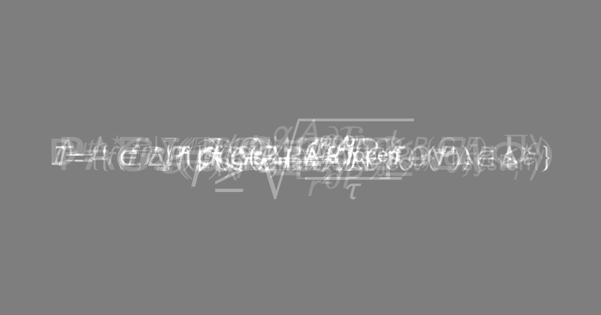
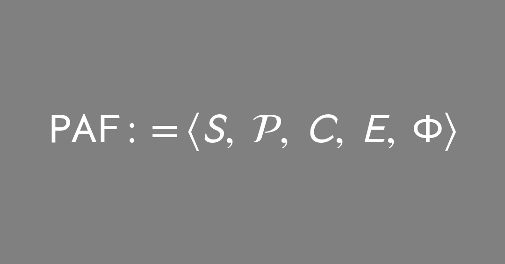
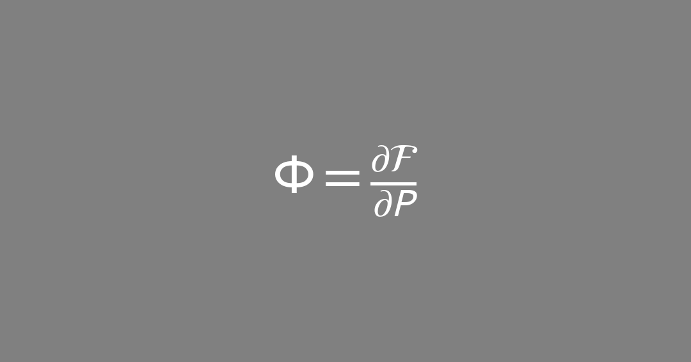
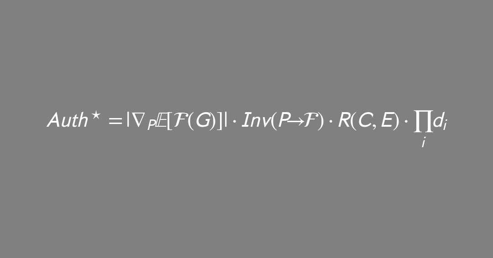
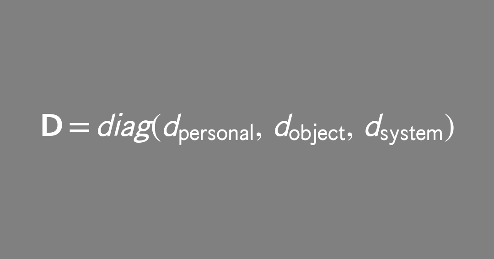
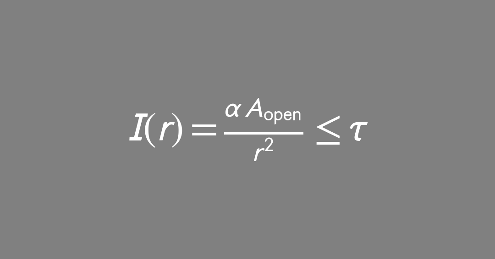
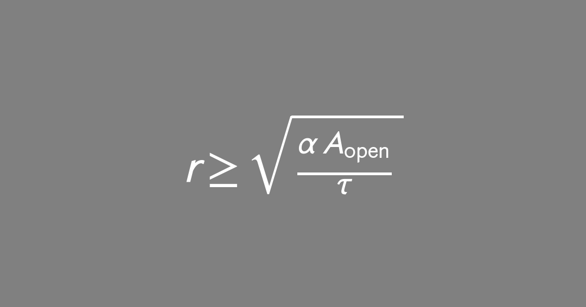

`projects/theses/parametric_authorship.md`
### **Thesis Prototype**

# **The Fourth Dimension as Execution**
## *A Formalisation of Parametric Authorship via the Hyperstrate, Semiological Ground, and Systemic Implications*

> Operates under the praxis in **../README.md** (canonical mirror: https://github.com/AndreClements/README/blob/main/README.md).  
> Style & axiology: *as-if / if-not*, maculate design, sovereignty over victory, scaled validation by risk_index.
> ```yaml
>contract:
>  intent: "doctoral thesis draft (practice-led, theory-bearing, SOLID)"
>  scope: "projects/theses/parametric_authorship.md"
>  validation: ["falsifiability_probe","AndYet_counterread"]
>  repository_binding:
>    base_rel: "https://github.com/AndreClements/README"
>    methods_rel:
>      - "../docs/methods/METHODOLOGY_CI.md"
>    protocols_rel:
>      - "../docs/protocols/observerCircuitBreaker_DBC_CQS.md"
>      - "../docs/protocols/PROTOCOL__agentic_envelope.md"
>      - "../docs/protocols/PROTOCOL__provenance_ledger.md"
>    dependencies_rel:
>      - "../docs/DEPENDENCIES.md"
> ```

# Abstract



> *A composite superposition of the core formalisms presented in this work.*

> **Plain-English abstract (120 words).**
> This thesis shifts authorship from "making a thing" to **designing rules** that reliably produce families of things. Meaning isn't only in a finished picture or paragraph; it's in the **mapping** from rules to outputs. I call the stack where rules live the **hyperstrate** (tools, defaults, policies). I formalise an author's role as a **Parametric Author Function (PAF)**—the way a person shapes a system's sensitivity to change—then test it in a practice-led case study. A small governance kit (assembly header, provenance ledger, circuit breaker) keeps dignity, consent, and refusal front-and-center. The result is a practice that privileges **decisions over spectacle**, and a critique method that measures **invariants** (what stays stable) and **designed transitions** (what changes on purpose).

**Working axioms: A0–A7 (see §2.5).**

**Parametric Authorship (PA)** recasts creative agency... from content inscription to **rule design across strata**. In a maculate, computationally entangled milieu, the decisional locus moves to constraints, ranges, contracts, and locks that shape families of outcomes. This work formalises: (i) the **Hyperstrate**—the superposed layer of tools, defaults, policies, logistics on which PA operates; (ii) a **Parametric Author Function (PAF)** modelling agency as sensitivity-shaping under contract; and (iii) a **Parametric Semiotic Triangle** in which meaning is borne by mappings, not tokens. A dignity-preserving governance stack (assembly header, agentic envelope, provenance ledger, circuit breaker) is specified and tested in practice-led case studies. The thesis argues that **execution is the fourth dimension of form**: agency proves itself by invariants under small perturbations and designed transitions under declared shocks.

# 1. Introduction — From Marks to Maps

Traditional authorship imagines a bounded maker inscribing determinate marks. **Parametric authorship** treats the authorial act as the **design of control surfaces**: articulate rule-sets, set ranges, fix locks; let a generator instantiate instances. Law, pedagogy, and critique remain token-centric; this produces analytical blind spots when outputs are **distributions** and agency is **upstream**. A sail can be a flag, a flag can be a sail: authorship is the rigging of surfaces that both move and mean.

**Research Questions**

1. What constitutes an authorial act where outputs are *families*, not singulars?
2. How does meaning stabilise when the sign vehicle is **generated under constraint**; what is the semiotic status of the constraint system?
3. Which governance/pedagogical protocols sustain **sovereignty, safety, dignity** when host defaults and opaque models are silent co-authors?

**Hypothesis (operational)**
Agency and meaning in PA are legible and defensible at the level of **rule specification, sensitivity control, and auditable provenance**. The critical unit is the **mapping** and its **stability under perturbation**.

# 2. Definitions & Scope

* **Hyperstrate.** The cross-cutting layer of influence—weights, datasets, UI affordances, platform policies, economics, rubrics, studio logistics—on/through which PA operates and where domain rule-design **impacts and affects** the work.
* **Parametric Author Function (PAF).** The authored tuple and shaping functional that constrain a generator.
* **Dignity (tri-scoped).** Personal (operator sovereignty), object (integrity of non-human participants), system (emergent integrity of the stack).
* **Maculate design.** Assume flaws and history in all systems; build protocols, not purity. *(cf. ../README.md)*

**Micro-glossary**

* **Invariant** — feature stable under small parameter nudges.
* **Designed transition** — intended feature change under declared shocks.
* **Empty Turn** — sovereign refusal to execute and/or allow extraction.
* **SOLID** — five object-oriented design principles (Single Responsibility, Open-Closed, Liskov Substitution, Interface Segregation, Dependency Inversion).\[^solid]

**Symbol legend (concise)**
`S,P,C,E` substrates, parameters, constraints, environment · `G` generator · `ℱ` feature extractor (or `F = {f₁...fₖ}` as component features) · `ε` small radius in `P` · `δ` invariance tolerance (output deviation) · `τ` exposure/extraction threshold · `α` transmissivity ∈ \[0,1] (1 − attenuation) · `κ` adapter map · `η` minimum dignity floor (declared, > 0) · `β` smoothing constant for Invₑ denominator (> 0) · `‖·‖` L2 norm unless stated · `‖·‖_F` Frobenius norm (matrices/Jacobians) · `𝔼_G` expectation over stochastic elements in G.

## 2.5 Axioms (small)

> Compact invariants that bind the thesis across theory, governance, and studio practice.

> **Aesthetic frame (the genus).** These axioms operate within the operator's theory of art: *art is the appreciable manifestation of creativity; creativity is the making of new relations between elements, towards the desirable* — where the desirable is a dependent variable, not a `const`. Parametric authorship is the relation-making engine; A3 (dignity conservation) is one binding of the desirable; the **felt-beauty claim** (masters paper §6) is the authored-case *species* of the genus. The genus has no outside, and is named here as the frame the axioms are read *within*, not as a peer of them. See [theory_of_art.md](../../docs/models/theory_of_art.md).

* **A0′ — The Two-Tier Cut (meta-axiom).** `read(axiom) := tier(axiom) ∈ {constitutive, scoped}`
  (Every axiom below is read on one of two tiers. **Constitutive** axioms forbid no observation; they are judged by fertility and coherence, not by a crucial experiment. **Scoped** axioms carry defeaters, name their boundaries, and answer to evidence. The cut keeps constitutive claims from borrowing the empirical credit of the scoped ones, and keeps scoped claims from inheriting the constitutive ones' immunity to disproof. Rendered `A0′` (prime, no star). Source: masters paper §2, promoted 2026-06-29; held lightly.)
  - **Constitutive:** A0, A1, A2. **Scoped:** A3, A4, A5, A6, A7, A8.

* **A0 — Equation-as-Machine.** `equation ≡ language_machine`
  (A formal expression is an executable grammar; reading = running.)

* **A1 — Map-over-Mark.** `meaning := invariants(P → A)`
  (Meaning is borne by stable features of the mapping from parameters to artifacts.)

* **A2 — Execution-First Form.** `form₄ᴰ := (geometry, material, time, execution)`
  (The fourth dimension of form is execution; proofs live in runs, not statements.)

* **A3 — Dignity Conservation.** `let d := (d_personal, d_object, d_system) ∈ [0,1]³; D := diag(d); conserve(D) := (∏ᵢdᵢ > 0) ∧ (minᵢ dᵢ ≥ η)`
  (Sovereignty must be conserved across operator, object, and system scopes. The product condition detects total collapse—if any dᵢ = 0, Auth★ zeroes. The floor η > 0 prevents erosion below a viable level; η is context-specific and declared in the assembly header. **Status: emergent** — dignity arises within the coupling of the parties, neither imported as an external deontic axiom nor epiphenomenal to the run; it has causal weight (it can zero Auth★) precisely because it is constitutive of the coupling, not added to it. Source: masters paper §2, promoted 2026-06-29.)

* **A4 — Defaults Author.** `host_defaults ∈ S ⇒ coauthor(host_defaults, 𝒜)`
  (Platforms, weights, and policies are co-authors of artifact families unless disclosed and bounded.)

* **A5 — Withdrawal Right.** `∀ participant: hasExit(contract, participant) = true`
  (Refusal/exit is a first-class operation; no consent, no extraction.)

* **A6 — Provenance is the Indexical Trace.** `indexical_trace := ledger(commit_hashes, locks, deltas)`
  (The "stroke" in PA is the recorded decision and its hash.)

* **A7 — Dependency Inversion of Dignity.** `policies depend_on abstractions; tools implement_via adapters`
  (High-level authorial policies depend on declared **abstract interfaces**; concrete tools must conform via **adapters**. Dignity is enforced at the interface, not begged from implementations.)

* **A8 — The Answerable Maker (scoped).** `author(𝒜) = distributed; account(𝒜) = concentrated`
  (Authorship may distribute across substrates, defaults, and co-agents (A4); the account is owed by the one who set the control surfaces and chose to launch the run. The sailor sets the sails and the tiller, not the wind, and answers for the voyage all the same. Distinct from A4 (which distributes authorship) and A6 (which records the trace): A8 locates *responsibility*, which neither does. Source: masters paper §2, promoted 2026-06-29; held lightly.)

**Corollaries.**
C1: `if feature_overlap(artifact, source) ≤ τ then translation; else transplantation (blocked)`
  (Translation ≻ transplantation: operations exceeding extraction ceiling τ are disallowed.)
C2: `merge := quorum + dissent` (minority views persist as first-class artifacts).

## 2.6 Delimitations (what this work does and does not claim)

* **Relations, not essences.** The framework addresses **relations of access** within a declared agentic envelope; it makes **no claim** to total access to objects.
* **Practice-led evaluation.** Evidence is drawn from case studies and controlled probes (host-switch, obstruction toggles, prompt perturbations); **industrial generalization is out of scope**.
* **Model-agnostic formalism.** Examples use image/drawing as an **ideogram**; the mathematics applies to text/audio/code *mutatis mutandis*.
* **Legal posture (descriptive, not prescriptive).** Legal doctrine appears only to **motivate assembly-level attribution and provenance**; this work **does not advance new legal theory** nor offer legal advice. Jurisdictional specifics are acknowledged but not analyzed in depth.

## 2.7 SOLID alignment (design contracts)

> The thesis architecture is engineered to respect SOLID at both code-level metaphor and protocol-level practice.

| SOLID principle           | In this thesis                                                                                                                                                         | Why it matters here                                                           |
| ------------------------- | ---------------------------------------------------------------------------------------------------------------------------------------------------------------------- | ----------------------------------------------------------------------------- |
| **Single Responsibility** | Each artifact/role has one reason to change: *Language Card* (rules), *Assembly Header* (context), *Ledger* (trace), roles D/A/E/LM (intent/access/discretion/filter). | Keeps authorship legible; decisions don’t leak across concerns.               |
| **Open–Closed**           | Protocols open to extension (add new obstructions, checks, hosts) but closed to modification of core invariants (locks, exits, ledger schema).                         | Extends practice without breaking prior proofs of dignity/sovereignty.        |
| **Liskov Substitution**   | Substrates (S) are substitutable if they implement required interfaces: header disclosure, refusal semantics, provenance hooks.                                        | Enables host/model swaps for perturbation tests without rewriting governance. |
| **Interface Segregation** | Small, purpose-built interfaces: *Language Card*, *Header*, *Ledger*, *Circuit Breaker*—no “fat” god-objects.                                                          | Practitioners implement only what they actually use; reduces coupling.        |
| **Dependency Inversion**  | High-level policies depend on **abstract interfaces** (header/ledger/exits), not concrete models; concrete tools adapt via ports/adapters.                             | Preserves sovereignty: policy governs tools, not vice versa.                  |

**Minimal interface sketch (ports/adapters)**

```pseudocode
interface Header { disclose_defaults(); context(); hash(); }
interface Ledger  { record(event); query(filter); export(); }
interface Exits   { has_exit(participant); empty_turn(); }
interface Host    { run(P); implements(Header, Ledger, Exits) }

fn execute(PAF, Host h):
  require h.disclose_defaults() && h.has_exit("*")
  h.record("locks", PAF.locks)
  return h.run(PAF.params)
```

# 3. Theoretical Framework

## 3.1 The Hyperstrate

Authorship is exercised **across** the hyperstrate by selecting substrates, exposing/occluding parameters, declaring contracts, and fixing locks. The relevant philosophy is anti-essentialist, **object-respectful**, and pragmatic: treat hosts, datasets, materials, and policies as **actants** with constraints that must not be collapsed to mere utility.

## 3.2 The Parametric Author Function (PAF)

Let $S$ be the substrate stack (tools/models), $P$ the parameter vector (rules/ranges), $C$ constraints (intent/obstructions), $E$ environment (budgets/governance). A generator $G:(S,P,C,E)\mapsto\mathcal{A}$ yields an artifact family $\mathcal{A}$.

Define the authored tuple:

[^eq_paf]

where the admissible parameter space is $\mathcal{P}\subseteq\mathbb{R}^{n}$ and $\Phi$ is a **shaping functional** over sensitivities (e.g., $\Phi=\frac{\partial\mathcal{F}}{\partial P}$, with $\mathcal{F}$ a feature extractor on $\mathcal{A}$).

[^eq_param]
[^eq_phi]

**Agency metric (intuition):**

[^eq_auth]

Here $J := \nabla_{P}\,\mathbb{E}_{G}[\,\mathcal{F}(G)\,]$ is the Jacobian of expected features with respect to parameters, and $J_{\mathrm{ref}}$ is the Jacobian evaluated at the initial/default parameter configuration—the "before I started" baseline. The Frobenius norm $\Vert\cdot\Vert_F$ is used for matrices. All four factors are dimensionless, so Auth★ is a relative sensitivity score: how much more do my knobs matter now than where I began?

The dignity invariants $d_i$ are bounded as $d_i\in[0,1]$.

![\$d\_i\in\[0,1\]\$](assets/parametric_authorship_equations_cards_mathtext/06_d_bounds.png)[^eq_dignity]

Define `Invₑ(P,ℱ) := clamp₍₀,₁₎[ 1 − (max_{‖ΔP‖≤ε} ‖ℱ(G(P+ΔP)) − ℱ(G(P))‖) / (‖ℱ(G(P))‖ + β) ]`, a normalised invariance score over the ε-ball in `P`, bounded in `[0,1]`. The smoothing constant β > 0 prevents degenerate cases when the baseline feature vector vanishes; the clamp guarantees the stated range even when maximum deviation exceeds the baseline norm. In practice, the inner maximisation is estimated via worst-of-k sampling over the ε-ball, not exact optimisation.
Define `R(C,E) ∈ [0,1]` as a run-readiness/risk governor derived from declared constraints `C` and environment `E`.
Unless stated otherwise, `‖·‖` denotes the L2 norm and `𝔼_G` denotes expectation over stochastic elements in the generator.

## 3.3 Parametric Semiotic Triangle

Extend Saussure/Peirce to generated media:

* **Vertex 1 — Rule Manifold $\mathcal{P}$** (e.g., *Language Card* rules).
* **Vertex 2 — Generated Vehicle Family $\mathcal{A}$** (instances).
* **Vertex 3 — Interpretant Field $\mathcal{I}$** (audience inference of the mapping).

Meaning stabilises as:

* **Invariants:** features persistent under small $\Delta P$.
* **Designed transitions:** features that change predictably under intentional shocks.
* **Style:** curvature of $\mathcal{P}$ as perceived via $\mathcal{A}$ (how features bend to parameter movement).
* **Non-exhaustion premise:** The triangle models relations of access, not the object in full.

## 3.4 Dignity Across the Hyperstrate

Introduce a **dignity tensor** $\mathbf{D}$:

[^eq_dignity]

For clarity: let \$\mathbf{d}:=(d\_{\mathrm{personal}}, d\_{\mathrm{object}}, d\_{\mathrm{system}})\in\[0,1]^3\$ and define \$\mathbf{D}:=\operatorname{diag}(\mathbf{d})\$.

**Minimal invariants (run-time checks):**

* **Withdrawal allowance:** any participant may refuse extraction beyond scope.
  Test: `hasExit(contract, participant)==true`.
* **Default disclosure:** assembly header declares host/weights/policy/limits.
  Test: header present + versioned.
 **Extraction ceiling:** translation $>$ transplantation; surface overlap ≤ $\tau$.
  Test: `feature_overlap(A_final, source) ≤ τ`.
* **Reciprocal ledger:** record non-human impacts.
  Test: ledger includes `non_human_impact` rows at publish.

## 3.5 Dependency Inversion for Objects in the Wild (DIOW)

**Statement (adapted from SOLID’s DIP).**
High-level policies of authorship (sovereignty, provenance, refusal) **must not depend** on the concrete details of tools, platforms, or hosts. **Both** the policies and the tools depend on **abstractions** (a public contract). Tools engage only through **adapters** that satisfy this contract.

**OOO compatibility.**
OOO says objects are withdrawn. DIOW therefore renounces access to inner essences and binds interaction to **accessible surfaces** declared in an interface. We don’t “know” the object; we **negotiate** a boundary.

**Abstract Interface (AII).**
Our interface is the quartet already present in the praxis:
(1) **Assembly Header** (defaults disclosure) aka Dreamer
(2) **Provenance Ledger** (indexical trace) aka Analyst
(3) **Circuit Breaker** (sovereign exit) aka Editor
(4) **Dignity Linter** (run-time checks) aka Maintainer

**Formal hook.**
Let the generator be `G:(S,P,C,E)→𝒜`. Partition `S = S_impl ⊕ S_iface`.
Authorship acts on `S_iface` (the interface layer) and never assumes internals of `S_impl`. A **conformance map** `κ : S_impl → S_iface` (the adapter) must exist such that all obligations are discharged:

$$\forall,o\in S_{\mathrm{impl}}:; \texttt{Header}(κ(o))\wedge \texttt{Ledger}(κ(o))\wedge \texttt{Exit}(κ(o))\wedge \texttt{Lint}(κ(o)) .
$$

No `κ` ⇒ no engagement.

**Design consequence.**
Authorship = design of the interface + tests. Implementations come and go; the contract and its proofs persist.

## 3.6 Dependency Inversion on Cybernetics (Sovereign Interface)

**Claim.** Parametric Authorship applies **dependency inversion** to a classical cybernetic loop. High-level policy (A3–A7) is externalised as a public **Sovereign Interface**; concrete tools/hosts must conform via adapters `κ`. Refusal is an admissible control action.

### Classical loop (first-order)
Reference (implicit goal) → Comparator → Controller → Actuator → Plant → Sensor → (back to Comparator)

### Inverted loop (sovereign)
Policy `π` (A3–A7) → **Linter/Circuit Breaker** → `κ`-adapted Actuator → Plant (`S_impl`) → **Header+Ledger** (sensors) → Linter  
with **Policy `π` declared at the interface**: `I := {Header, Ledger, Exit, Lint}`.

#### Dependency graph
- Classical: **Operator → Tool’s Interface → Tool’s Internal Goal → Output**
- Sovereign: **Tool → I(π)** and **Author → I(π)**; **no `κ` ⇒ no engagement**.

#### Comparison (delta)

| Aspect                | Classical cybernetics                    | Parametric Authorship (DI on cybernetics)             |
|---|---|---|
| Locus of control      | In the plant’s pre-set logic            | In author’s external contract `π`                     |
| Primary goal          | Operational homeostasis (e.g., temp)    | Ethical/authorial invariants (`d`, consent, provenance) |
| Tool’s role           | Environment you adapt to                 | Replaceable impl bound to `I` via `κ`                 |
| Dependency flow       | Operator depends on tool                 | Tool depends on interface `I(π)`                      |
| Governor              | Internal controller                      | External **Linter + Circuit Breaker**                 |
| Observability         | Sensors for state                        | + **Provenance** as sensor (ledger)                   |
| Control actions       | Tune gains                               | + **Refusal/Exit** as first-class action              |

#### Formal sketch
Let `G:(S,P,C,E)→𝒜`, partition `S = S_impl ⊕ S_iface`.  
Policy `π` induces interface `I = {Header, Ledger, Exit, Lint}`.  
An adapter `κ:S_impl→S_iface` is admissible iff
\[
\forall o\in S_{\mathrm{impl}}:\; \texttt{Header}(κ(o)) \wedge \texttt{Ledger}(κ(o)) \wedge \texttt{Exit}(κ(o)) \wedge \texttt{Lint}(κ(o)).
\]
**No** such `κ` ⇒ **block** (refusal).

**Objective.** Maintain declared **invariants** under ε-nudges; realise **designed transitions** under declared shocks; conserve dignity tensor `d`.

#### Probes
1. **Host-switch invariance:** swap `S_impl`; if `κ` exists and lints pass, features stay within ±ε.  
2. **Defaults-drift audit:** mutate `defaults_digest`; linter must re-authorise or block with ledgered reasons.  
3. **Refusal liveness:** invoke `exit()` mid-pipeline; verify zero further extraction + ledger entry.

> Metaphor: you don’t learn a thermostat’s quirks; **furnaces must prove they plug into your home’s “Safety & Dignity” port**.

# 4. Methodology — Practice-Led with Controlled Probes

## 4.1 Sites & Materials

Primary case: **[TBD — case study pending]** implementing rule extraction, locks, and self-audit. Candidate: *Threshold Mechanics and the Claude Constitution* *(../workbench/sketch\_\_threshold\_mechanics\_claude\_constitution.md)* — a critical commentary on Anthropic's AI constitution developed collaboratively between human operator and AI instance, testing parametric co-authorship in document synthesis. Secondary micro-studies probe host-default tilt and parameter sensitivity.

> **Realised practice-led companion (2026-06-26):** a practice-led case study now fills this slot — [parametric_authorship_masters.md](parametric_authorship_masters.md), *Composed, Not Generated*, reading the Objectification Workshop and the layered-averaging works (Eve Song, University of Pretoria) through the apparatus above. It cites this thesis rather than re-deriving it.

## 4.2 Instruments

* **Assembly Header & Agentic Envelope** *(../docs/protocols/PROTOCOL\_\_agentic\_envelope.md)*
* **Provenance Ledger** *(../docs/protocols/PROTOCOL\_\_provenance\_ledger.md)*
* **Circuit Breaker** with falsifiability + exit *(../docs/protocols/observerCircuitBreaker\_DBC\_CQS.md)*
* **Dignity Linter** (pseudocode in §5.3)

## 4.3 Data

Artifacts (drafts, revisions, final outputs), rule specifications, mapping notes, provenance ledgers, time-on-task, perturbation results (host-switch, prompt nudges, obstruction toggles).

## 4.4 Analytic Strategy

* **Invariance tests:** measure persistence of declared rules under $\Vert\Delta P\Vert\le\epsilon$.
* **Transition tests:** confirm designed changes under declared shocks (obstructions).
* **Default-tilt diffs:** same prompt across hosts; record drift as host responsibility.
* **Authorship legibility:** correlate rubric “decision coherence” with ledger completeness and lock adherence.
* **Non-exhaustion check:** no test claims total access; results are scoped to the declared envelope.
* **Adapter existence test:** For each engaged tool/host, demonstrate a concrete `κ` (adapter) and show it passing `header/ledger/exit/lint`.
* **Host-switch invariance:** Swap `S_impl` (e.g., two LLM hosts). If adapters exist, decision-level invariants must persist (±ε).
* **Refusal liveness:** Trigger `exit()` mid-pipeline; verify no further extraction occurs and ledger records refusal with reasons.
* **Defaults drift audit:** Change host defaults; `header.defaults_digest` must change; `lint` must re-run and either PASS or BLOCK.

## 4.5 Validity & Limits

Threats: skill heterogeneity, uneven tool access, rubric bias. Mitigations: low-cost kit, rule-first pedagogy, double-marking with dissent kept, protocolised exits. External validity: tested in constrained academic setting; industrial generalisation deferred.

## Quad Face Protocol

### Roles

* **D — Dreamer (seed):** introduces intent + material.
* **A — Analyst (opening / access):** reveals structure → `diagnostic`, `affordance_map`, `access_notes`.
* **E — Editor (closing / discretion):** limits exposure safely → `discretion_map`, `constraints`, `closure_reasons`, `delta±`.
* **LM — Lead Maintainer (filter):** no content edits. Checks integrity (consent, provenance, reversibility, scope). Issues **status only**.

### One Lap (plane-only)

1. **D →** `S₀ + header`
2. **A →** `S₁ = S₀ + diagnostic + affordance_map`
3. **E →** `S₂ = S₁ + discretion_map + constraints (+ delta log)`
4. **LM →** **PASS | RETURN(A/E) | HOLD**, with reasons & refs. Records dissent if unresolved.

On **PASS**, an external **Host/Executor rail** performs the act (publish/archive/route) and writes its own run-log referencing the LM pass. Execution = **off-plane extrusion**, not a node.

### Emissions (per node)

* **D →** `intent`, `material`
* **A →** `diagnostic`, `affordance_map`, `access_notes`
* **E →** `discretion_map`, `constraints`, `closure_reasons`, `delta±`
* **LM →** `filter_reasoning`, `status`

### LM Filter — can / cannot

**LM can:**

* **Gate**: pass / hold / return-with-reasons.
* **Reconcile**: surface conflicts (A vs E), propose **options**, never impose edits.
* **Verify**: consent, provenance, scope adherence, reversibility path.
* **Bind**: attach minimal reasons + references (no content changes).

**LM cannot:**

* Alter payload content, authorise new content, or collapse dissent.
* Silence A or E; must log minority positions when unresolved.

### Invariants (LM linter)

1. **Consent/Non-extraction** — source, rights, withdrawal path present.
2. **Traceability** — header present; deltas/thresholds signed.
3. **Reversibility** — one-lap rollback demonstrable.
4. **Optionality** — real exit that isn’t reputationally punitive.

Fail any → **RETURN→E** with the smallest rule to pass next lap.

### Deadlock mediation (A ↔ E)

LM issues **options, not rulings** (team chooses; LM records *why*):

1. publish with E-constraints intact + A access notes;
2. publish a redacted bundle + private annex;
3. defer; run consent refresh;
4. split release: public set vs restricted archive.

### Ledger line (minimal schema)

`timestamp | node[D/A/E/LM] | action | reasons | refs[consent,prov] | delta±/threshold? | dissent? | status`

---

### Quadratic Illumination Model (for expansion)

A compact ideogram using quadratic fall-off to couple opening and discretion.

* Let the **origin** $O$ be `(intent, consent)`.
* Let $r$ be **exposure distance** (reach/context distance: audience size, platform spread, time horizon).
* Let $A_{open}$ be Analyst’s proposed **opening amplitude** (legibility/affordance strength, unit‑less scale).
* Let $\tau$ be Editor/LM **exposure threshold** derived from consent/risk.
* Let $\alpha\in[0,1]$ be Editor's **attenuation** (redaction/obfuscation factor).

All variables in this ideogram are dimensionless scores: $r$ is a normalised exposure-distance index (not physical distance), $\tau$ a normalised consent-derived threshold, and $\alpha$, $A_{\mathrm{open}}$ unit-less as noted above. The inverse-square form is adopted for its intuitive coupling of opening and discretion, not as a physical model.

**Illumination constraint (with α as transmissivity):**

[^eq_illum]

**Reads:** the farther an artefact travels from its consent/intent origin (larger $r$), the less intensity is allowed. This can be expressed as a minimum safe exposure distance:

[^eq_radius]

* **Reduce** $A_{open}$ (narrow affordances),
* **Increase** $r$ (restrict channels/audiences),
* **Decrease transmissivity** $\alpha\to\alpha'$ (i.e., increase attenuation via redaction/blur),
* **Re‑derive** $\tau$ with refreshed consent or new risk model.

> This model is an **ideogram**, not a metric: it encodes how A (opening) and E (discretion) co-determine safe exposure. Use it to explain decisions and to sketch “what would it take to publish?” scenarios.

# 5. Governance Architecture — The Fourth Dimension is Execution

## 5.1 Assembly Binding (who/what is operating)

Record **surface, model family, role, tools, retrieval, operator, tier**, and compute a contract hash. *(../docs/protocols/PROTOCOL\_\_agentic\_envelope.md)*

## 5.2 Ledger (the new indexical trace)

Claims, rule locks (e.g., value by D9), host defaults, parameter deltas, validation method, sceptic pass, **non-human impact**. *(../docs/protocols/PROTOCOL\_\_provenance\_ledger.md)*

## 5.3 Dignity Linter (studio-safe)

```pseudocode
fn dignity_lint(assembly, contract, language_card, artifacts):
  assert assembly.has_defaults_disclosed()
  assert contract.has_exit_for_all_nodes()

  τ := contract.extraction_ceiling
  overlap := feature_overlap(artifacts.A0, contract.source_grammar)
  if overlap > τ: raise "extraction_ceiling_exceeded"

  assert language_card.contains("Dignity rule")
  assert artifacts.mapping_note.includes("translation") && includes("refusal")

  if artifacts.ledger.non_human_impact.empty():
    warn "ledger_missing_nonhuman_rows"
  return "ok"
```

### 5.x Adapters (making concrete things honor the abstract interface)

```pseudocode
// The abstract, ethics-first contract
interface SovereignInterface:
  fn header() -> Header           // host, weights, policy, limits
  fn ledger(event) -> void        // append immutable, signed record
  fn exit(reason) -> bool         // hard refusal path
  fn lint(bundle) -> "ok"|"fail"  // Axioms A3–A6 checks (and A7)


// Example: LLM host adapter (opaque, networked)
class LLMHostAdapter implements SovereignInterface:
  fn header():
    return {host, model_family, version, policy_url, limits, defaults_digest}
  fn ledger(event):
    append_signed(event, anchor=commit_hash)
  fn exit(reason):
    revoke_token(); return true
  fn lint(bundle):
    assert header.defaults_digest; assert bundle.overlap ≤ τ; return "ok"


// Example: Material adapter (charcoal/paper = non-networked)
class MaterialAdapter implements SovereignInterface:
  fn header():
    return {surface:"A0 cartridge", tools:["charcoal","graphite","ink"], hazards, studio_limits}
  fn ledger(event):
    stamp(event, time, operator); archive_photo_if_needed()
  fn exit(reason):
    pause_use(); quarantine material; return true
  fn lint(bundle):
    assert "Dignity rule" in bundle.language_card
    assert locks: value_by_D9 & edge_by_D11
    return "ok"
```

# 6. Pedagogy — Author Rules, Not Posters

* **Rule Extraction** from initial sparks; surface artifacts discarded after articulation.
* **Rule Locking** to force coherence (declare invariants before execution).
* **Obstructions** (consent-based) to learn designed transitions.
* **Self-Audit** allocating weight across ideation/decisions/craft/risk/language.
* **Critique norm:** *describe the move, not the person*.

# 7. Semiological Analysis — Propositions

**P1.** In PA, the sign’s primary bearer is the **mapping** $(\mathcal{P}\to\mathcal{A})$, not any instantiated token.

**P2.** **Meaning** appears as invariants and designed transitions recoverable by perturbation tests.

**P3.** **Style** = perceived curvature of $\mathcal{P}$ under feature extraction $\mathcal{F}$.

**P4.** **Authorship** = sensitivity shaping under contract, evidenced by locks, ledgers, and stability.

**P5.** **Dignity** must be conserved across personal/object/system scopes to count agency as ethical.

**P6.** **Critique** should prefer protocol diffs (decisions, locks, invariants) over token aesthetics alone.

# 8. Implications

* **For authorship law.** Shift to assembly-level attribution; require disclosed defaults and ledgers; value control/legibility over token novelty.
* **For institutions.** Audit hosts as co-authors; keep dissent/minority readings; adopt circuit-breaker norms.
* **For toolmakers.** Expose defaults; provide contract hooks (headers, ledgers, exits); permit refusal.
* **For materials.** Enforce “two transitions + one reserve” to honour object dignity of supports.

# 9. Positioning & Dependencies

Primary stance and protocols: **../README.md** (canonical: [https://github.com/AndreClements/README/blob/main/README.md](https://github.com/AndreClements/README/blob/main/README.md))
Methods/Protocols/Influences: see **../docs/methods/METHODOLOGY\_CI.md**, **../docs/protocols/**\*, **../docs/DEPENDENCIES.md**.

# 10. Contributions

1. **Conceptual:** Hyperstrate, PAF, dignity tensor, parametric semiotic triangle.
2. **Methodological:** Assembly header, ledger, circuit breaker, dignity linter, perturbation-based critique.
3. **Pedagogical:** Rule-first studio with locks/obstructions/self-audit; assessment privileging decisions over spectacle.

# 11. Execution Plan & Artefacts

* **Year 1:** Formalisation; pilot instruments; baseline case.
* **Year 2:** Multi-host perturbation studies; rubric/ledger correlations; publish protocols.
* **Year 3:** Consolidation; external replication kit; dissertation.
  **Outputs:** datasets of mappings/locks, ledgers, rubrics, code for linter, written thesis, replication notebook.

# 12. Conclusion — The Page Keeps the Trace

Parametric authorship relocates agency to **sensitivity design under contract**. Meaning lives in the **map**, not the single mark. With a dignity-preserving governance stack and perturbation-based critique, authorship remains sovereign—even as `theMachines` and materials co-author. The fourth dimension is execution; proof is in invariants and transitions recorded by the page and the ledger.

---

**Plain-English Equation Translations**

*In which the formalisms are translated for those of us who sensibly avoided mathematics at school but still want to understand what all the fuss is about.*

[^eq_generator]: *Plain-English (Eq. 1, Generator):* The Grand Machine takes your ingredients (tools, settings, rules, and whatever chaos the universe throws in) and produces... stuff. Lots of stuff, potentially. It's rather like a sausage machine, except the sausages might be poems or paintings, and nobody's entirely certain what went in. The important bit is that it's a *machine*—give it the same ingredients, it'll give you the same family of sausages, near enough. (Near enough. Which in mathematics means "don't ask about the edge cases unless you've brought drinks.")

[^eq_paf]: *Plain-English (Eq. 2, PAF Tuple):* This is your authorship packed into a lunchbox: your tools (S), your knobs to twiddle (𝒫), your rules about what's absolutely forbidden (C), the weather outside (E), and crucially—how much the whole thing wobbles when you actually *do* twiddle the knobs (Φ). The revelation here is that the lunchbox is the author. Not the sandwich. Not you. The *arrangement*. This troubles people who were hoping they were still in charge.

[^eq_param]: *Plain-English (Eq. 3, Parameter Space):* Your knobs live in a big box of numbers. It's got *n* dimensions, which is mathematician for "quite a lot of knobs, possibly more than three, and good luck visualising that." The ⊆ means your particular knobs are allowed to live *somewhere* in the big box, but not necessarily everywhere. Think of it as zoning regulations for creativity.

[^eq_phi]: *Plain-English (Eq. 4, Shaping Functional):* How much does the *interesting stuff* change when you nudge your settings? That's Φ. It's the derivative, which is calculus for "the thing that tells you whether poking this button will do anything worth poking it for." A high Φ means small tweaks, big changes. A low Φ means you could twist knobs all day and nobody would notice. Most of us have experienced both in committee meetings.

[^eq_auth]: *Plain-English (Eq. 5, Agency Metric):* How much are you *actually* the author? Well, it depends. First: does twiddling your knobs actually *do* anything observable? (That's the gradient bit—now normalised against where you started, so it's a proper score rather than a number whose size depends on what you happen to be measuring.) Second: when you're not twiddling, does the thing stay put? (That's Invariance—points for things that don't wander off when you stop watching them.) Third: are you actually allowed to run this? (Risk and readiness—someone checked, presumably.) Fourth: is everyone's dignity intact? Personal dignity, respect for your materials, and the system not being a total shambles—multiply them together. If *any* of these goes to zero, your authorship is zilch. This is the mathematical equivalent of "you're only as strong as your weakest excuse." (The ∏ symbol means "multiply everything together." Mathematicians love Greek letters. It makes them feel continental.)

[^eq_dignity]: *Plain-English (Eq. 6–7, Dignity Bounds & Tensor):* Dignity gets a score between zero (absolutely none—someone has been treated like furniture) and one (full dignity intact—everyone's been asked nicely and said yes). This applies to *you*, to *the things you're working with*, and to *the whole rickety system*. Line up your three dignities on the diagonal of a matrix. Why a matrix? Because mathematicians need something to do with their hands, and it lets you do operations on all three at once without playing favorites. Also, saying "dignity tensor" in meetings makes everyone pause respectfully, which is sometimes the whole point.

[^eq_illum]: *Plain-English (Eq. 8, Illumination Constraint):* Light gets dimmer the further you are from the lamp—specifically, it falls off with the *square* of the distance. This formula says your work's "brightness" (how exposed it is, how legible, how *seen*) is your openness (A_open) times how much you're letting through (α), divided by how far it's travelling (r²). The τ is your consent ceiling: "this bright and no brighter, or someone hasn't agreed to be looked at." Want to publish far and wide? Either dial down the intimacy, shrink your audience, or get better consent. Those are your three doors. Pick one or get blocked. (The inverse-square law was discovered by people who were trying to light their houses before electricity. They had to care about this sort of thing. Now you do too, except about exposure instead of candles.)

[^eq_feature]: *Plain-English (Eq. 9, Feature Extractor):* You've made something. Now, what *about* it? The Feature Extractor looks at your artifact(s) and produces a list of *k* numbers describing the interesting bits—color, density, how angry it looks, whatever you care to measure. It's like a very picky food critic, except instead of "hints of oak" you get "vector component seven is 0.34."

[^eq_invariant]: *Plain-English (Eq. 10, Invariant Set):* What *doesn't* change when you jiggle the controls a little bit? Those are your invariants—the features that stubbornly stay put even when you poke them. They're the personality of your rule-set. If you nudge your settings (ΔP, a small nudge) and certain features (f) refuse to budge, congratulations: that's your style. That's the stable bit. That's what you can take credit for. (The δ is the tolerance—"close enough." ε is "a small amount." In academic papers, these always turn out to be more complicated than they sound. Welcome to mathematics.)

[^eq_transition]: *Plain-English (Eq. 11, Transition Set):* What *does* change, *on purpose*, when you throw a planned spanner in the works? If you've said "when I toggle this obstruction, the mood should shift," and it *does*, and the shift is *in the set of changes you declared acceptable* (Δ*)—that's a designed transition. Not an accident. Not chaos. Intentional drift. It's the difference between "I meant to do that" and "oh dear."

[^eq_radius]: *Plain-English (Eq. 12, Radius Form):* This is equation 8, rearranged. If you know your openness, your transmissivity, and your consent ceiling, you can calculate the *minimum* distance your work has to travel before it's dim enough to be safe. Close audiences: more intimate. Distant audiences: needs more consent or less content. Mathematics is very keen on rearranging things. It makes the same idea look like new ideas. Publish enough rearrangements and you can have a career.

---

> **Appendices A–D and Reference Listing** have been extracted to [parametric_authorship_appendices.md](parametric_authorship_appendices.md) for context-window management.
